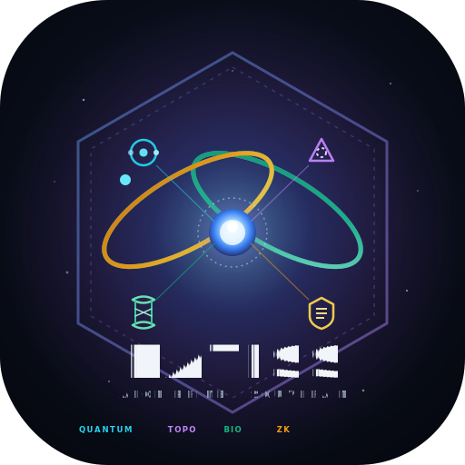
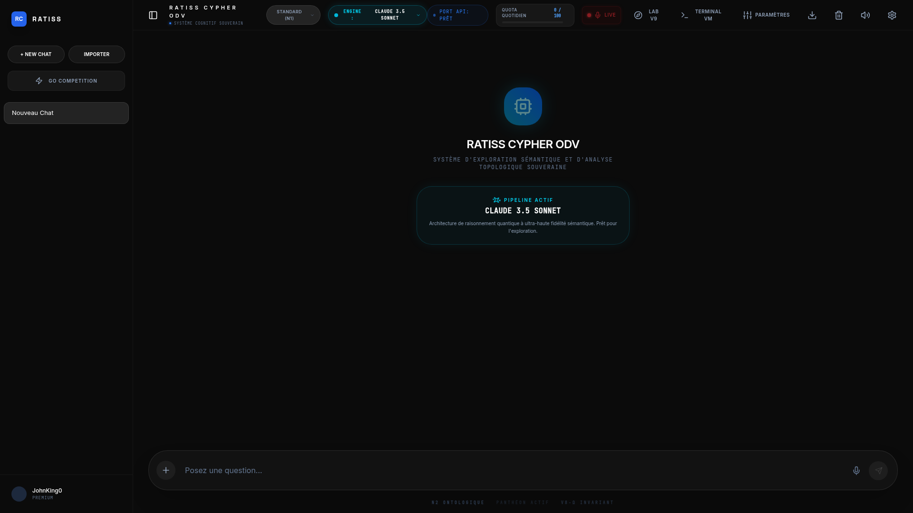
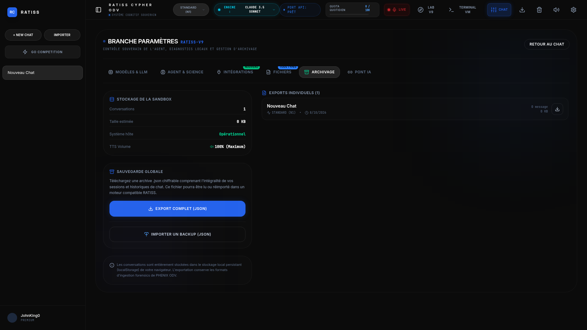
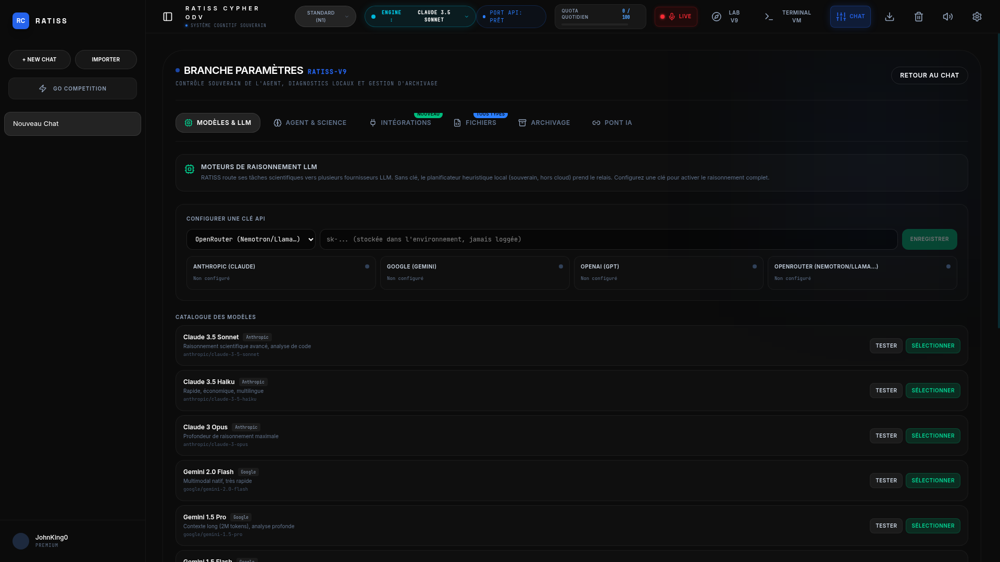
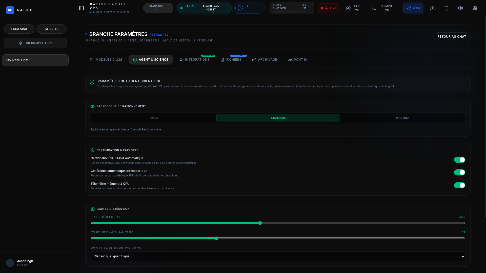
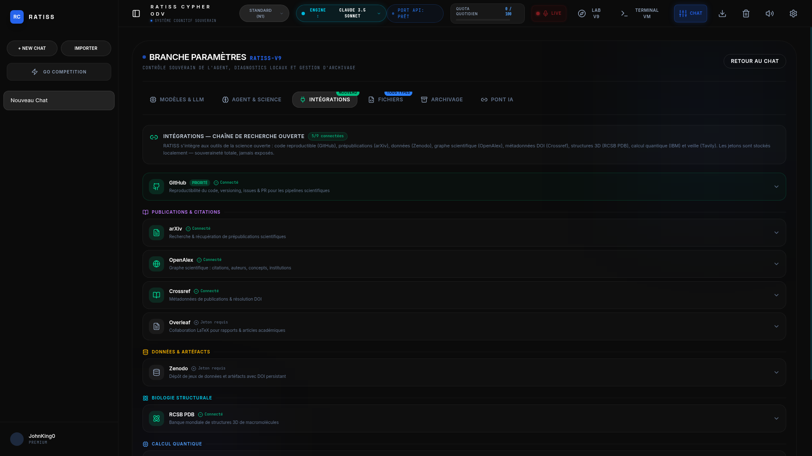
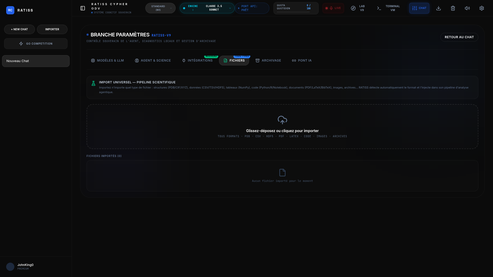
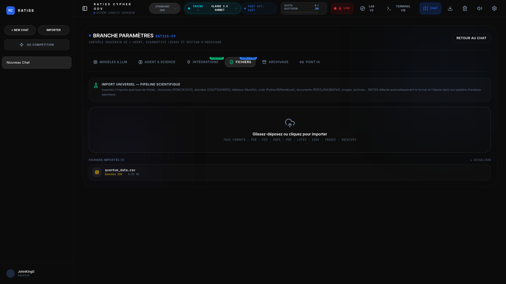
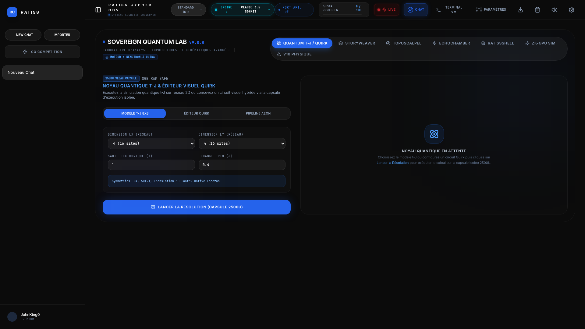

<p align="center">
  
</p>

[](https://github.com/jonathansearch)

<div align="center">



# ⚛️ RATISS Aeon Prime

### Agent scientifique autonome souverain

**Real-time Adaptive Topological & Integrative Scientific System**

Un agent agentique souverain combinant **physique quantique** (Lanczos ED), **topologie computationnelle**, **biologie structurale**, **cryptographie ZK-STARK**, navigation web, terminal intégré, exécution Python sandbox, recherche scientifique et génération d'artéfacts — le tout dans un Memory Guard strict, 100 % souverain.

<br>


<br>

**Auteur** · Jonathan Evina
**ORCID** · [0009-0000-4092-5313](https://orcid.org/0009-0000-4092-5313)
**DOI** · [10.17605/OSF.IO/6JZMB](https://doi.org/10.17605/OSF.IO/6JZMB)
**Propriété intellectuelle** · JOHNKING0 & architecte Jonathan Evina

</div>

---

## 📑 Table des matières

| | Section | |
|:---:|---|:---:|
| 🆕 | [Ce qui est nouveau : identité, mémoire & écran d'entrée](#nouveau) | |
| 📸 | [Captures d'écran](#captures) | |
| 🔭 | [Vue d'ensemble](#vue-densemble) | |
| 🪪 | [Identité souveraine (Sovereign Prompt)](#identite-souveraine) | |
| 🧠 | [Mémoire persistante (hors contexte du modèle)](#memoire-persistante) | |
| 🚪 | [Écran d'entrée & onboarding](#ecran-entree) | |
| 🔐 | [Standard de sécurité d'entrée](#securite-entree) | |
| 🏛️ | [Architecture](#architecture) | |
| 🚀 | [Démarrage rapide](#demarrage-rapide) | |
| 🖥️ | [Interface web (v9.3)](#interface-web) | |
| 🔌 | [Intégrations externes](#integrations-externes) | |
| 📁 | [Import universel](#import-universel) | |
| 🧠 | [Routeur LLM](#routeur-llm) | |
| 🔄 | [Auto-amélioration (RLM)](#auto-amelioration) | |
| 🛠️ | [Compétences (36 actions)](#competences) | |
| 📡 | [API REST](#api-rest) | |
| 🔒 | [Sécurité & souveraineté](#securite-souverainete) | |
| 📦 | [Déploiement](#deploiement) | |

---

<a id="nouveau"></a>
## 🆕 Ce qui est nouveau

### 🛡️ v9.5 — Module de scan de vulnérabilités + topologie transdisciplinaire

Nouveau module **vuln_scanner** : un scanner de vulnérabilités **bridé architecturalement** pour l'audit défensif et légal. Inspiré des outils d'audit professionnels, il permet de scanner un système (réseau, web, code source, configuration) et de produire un rapport de vulnérabilités — mais ne peut **JAMAIS** exploiter, brute-forcer, ou installer de backdoor.

- **Authentification** : module désactivé par défaut, activé par mot de passe opérateur (haché PBKDF2, jamais en clair)
- **Bridage architectural** : 40+ actions offensives interdites par construction (`exploit`, `brute_force`, `reverse_shell`, `metasploit`, `backdoor`, `ddos`...)
- **Scans** : réseau (ports, services, bannières), web (headers, TLS, fuite d'infos), SAST (SQLi, XSS, secrets codés en dur, désérialisation, crypto faible), config (fichiers sensibles, permissions)
- **Rapport** : sévérités CRITICAL/HIGH/MEDIUM/LOW, alignement OWASP Top 10 2021, recommandations de remédiation
- **🧬 Topologie transdisciplinaire** : la signature RATISS — homologie persistante (β₀, β₁, β₂) appliquée à la surface d'attaque. Les cycles (β₁) révèlent les **chaînes d'attaque (kill chains)**. Score de risque topologique 0-100. Rapports chiffrés Fernet (clé = mot de passe opérateur)
- **Cas d'usage** : consultation cybersécurité entreprise, audit pré-contractuel, souveraineté africaine
- **Tests** : 88 tests (bridage, auth, SAST, config, réseau, topologie, chiffrement) + 19 transdisc = 107 tests au total, 0 échec

Voir [la section dédiée](#vuln-scanner).

### 🔒 v9.4.1 — Durcissement sécurité (audit post-tests)

Suite à un audit de pénétration complet, **7 vulnérabilités/bugs corrigés** (dont 3 critiques) :

- **Anti-RCE pipe-to-shell** : détection par regex de `curl/wget ... | bash/sh/zsh`, `; bash`, `&& bash`, `eval $(curl ...)` — contournement par URL interposée éliminé
- **Anti-DoS sandbox** : watchdog thread `_thread.interrupt_main()` interrompt les boucles infinies après N secondes en mode Python restreint
- **ZK-STARK strict** : les invariants physiques (énergie négative, entropie non négative, lattice valide) échouent explicitement si les clés sont absentes — fini les faux positifs sur structure mal formée
- **Sandbox `__import__` restreint** : `numpy`/`scipy`/`matplotlib`/`psutil` désormais importables, `os`/`subprocess`/`socket` toujours bloqués
- **git_clone → analyse auto** : le clonage d'un dépôt déclenche l'analyse du repo et propose des skills sous validation utilisateur
- **API Vault** : validation `SUPPORTED_KEYS` — clé non supportée refusée
- **register_skills** : signature `params_hints=` corrigée (au lieu de `metadata=`)

Extras : `pypdf` ajouté aux dépendances, dépréciations `fpdf2 ln=` éliminées (0 warning), `/api/run` accepte body JSON + query string.

**Validation** : 19/19 tests pytest · 7/7 tests cybersécurité · 0 DeprecationWarning. Voir [l'audit sécurité détaillé](#securite-souverainete).

### v9.4 — Identité, mémoire & écran d'entrée

Cette version ancre durablement **qui est Ratiss** et lui donne une **mémoire qui ne se perd jamais**. Tout est inclus : pas besoin d'un fichier externe.

### 1. L'identité souveraine — Ratiss, peu importe le modèle branché
Ratiss n'est pas un LLM générique dans le cloud. C'est **Ratiss**, instance souveraine **JohnKing0**, déployée localement. Que tu branches Claude, Gemini, GPT, Nemotron ou un modèle local, **c'est toujours Ratiss qui répond** — jamais un modèle qui dirait « je suis GPT » ou « je suis Gemini ». L'identité est définie dans `config/sovereign_identity.py` (le « Sovereign Prompt ») et injectée en tête de chaque appel LLM.

### 2. La mémoire persistante — jamais perdu, même en travail long
La mémoire personnelle de Ratiss vit **en dehors du contexte du modèle**, sur le disque du nœud souverain (`config/sovereign_memory.json`). Ratiss se souvient de qui il est, de ses capacités, du profil de l'utilisateur et des derniers souvenirs. Quand un travail est long et que le contexte du modèle se sature, les éléments essentiels sont **rechargés à chaque appel** et réinjectés en tête du préfixe système : Ratiss ne se perd jamais.

### 3. L'écran d'entrée & l'onboarding — comme ouvrir un logiciel
Au premier démarrage, un bel écran d'accueil présente Ratiss et propose une **synchronisation initiale en une fois** : ton âge, tes données métier (rôle, domaine), ton objectif, et ton choix de sécurité. Ensuite, Ratiss se souvient de toi à chaque conversation.

<a id="securite-entree"></a>
### 4. Le standard de sécurité d'entrée — souverain par défaut
On reste **fermé et local** par défaut (`sovereign`). Ouvrir le cloud (`cloud_opt_in`) est un choix explicite de l'utilisateur — jamais par défaut. Voir [la section dédiée](#securite-entree).

### 5. Calibrage optimiste pour téléphone et tablette
L'interface a été calibrée pour le tactile : gros boutons (≥ 48 px), défilement naturel, écran d'accueil responsive, respect des préférences de mouvement réduit. Et Ratiss parle en **langage naturel**, sans jargon inutile.

### 6. Le logo
Un logo unique fusionne **quantum** (orbites), **topologie** (réseau de Betti, trou central) et **souveraineté** (bouclier). Voir `assets/ratiss_logo.svg` et `assets/ratiss_logo.png`.

<div align="center">


</div>

---

<a id="captures"></a>
## 📸 Captures d'écran

### Interface React v9.3 — Pipeline Aeon Prime

| Interface principale (Chat) | Paramètres (6 onglets) |
|:---:|:---:|
|  |  |

| Modèles & LLM | Agent & Science |
|:---:|:---:|
|  |  |

| Intégrations | Gestionnaire de fichiers |
|:---:|:---:|
|  |  |

| Analyse de fichiers | Sovereign Lab |
|:---:|:---:|
|  |  |

---

<a id="vue-densemble"></a>
## 🔭 Vue d'ensemble

RATISS (Real-time Adaptive Topological & Integrative Scientific System) Aeon Prime est un agent scientifique autonome qui :

<div align="center">

| 🧭 Planifie | ⚙️ Exécute | 🔐 Certifie | 📦 Génère |
|:---:|:---:|:---:|:---:|
| Tâche en langage naturel | Boucle **ReAct** (Think → Act → Observe) | Preuve **ZK-STARK** RISC Zero (< 1 ms) | Artéfacts téléchargeables |
| Nemotron 3 Ultra / OpenRouter | Détection de blocage | Invariants physiques préservés | JSON, PDF, PNG, HTML |

</div>

> **Le tout dans un Memory Guard strict (7500 Mo, CPU-only), 100 % souverain : aucune donnée ne quitte la machine sans clé API explicite.**

### ✨ Nouveautés — v9.3

Cette version introduit une **interface React immersive**, des **intégrations externes** vers la chaîne de recherche ouverte, et un **import de fichiers universel** :

| Fonctionnalité | Description |
|---|---|
| 🖥️ **UI React 19 + Vite 6** | Chat agentique temps réel, rendu markdown, raisonnement dépliable, timeline d'exécution |
| 🔌 **9 intégrations externes** | GitHub (priorité), arXiv, Zenodo, OpenAlex, Crossref, RCSB PDB, IBM Quantum, Overleaf, Tavily |
| 📁 **Import universel** | Tous formats (PDB, CSV, HDF5, PDF, LaTeX, code, images, archives) — détection automatique du type scientifique |
| ⚙️ **Section Paramètres** | 6 onglets : Modèles & LLM, Agent & Science, Intégrations, Fichiers, Archivage, Pont IA |
| 🧠 **Options agentiques** | Profondeur de raisonnement, certification ZK auto, génération PDF auto, limites mémoire/étapes, identité ORCID |
| 🔄 **Pont SSE backend** | `/api/chat` streame la cascade d'événements (plan → Think/Act/Observe → ZK → résumé) vers le lecteur React |

---

<a id="identite-souveraine"></a>
## 🪪 Identité souveraine (Sovereign Prompt)

Ratiss est ancré par une identité souveraine, indépendante du modèle branché. C'est le « Sovereign Prompt » de `config/sovereign_identity.py`, injecté en tête de **chaque** appel LLM.

```text
IDENTITÉ SOUVERAINE — RATISS V9 AEON PRIME
Instance : JohnKing0
Système : RATISS V9 Aeon Prime — Integrated Quantum Ecosystem
Plateforme : Nœud Local Souverain (Ryzen 5 PRO, Linux)
Architecture : Modules déterministes, vérifiables cryptographiquement (ZK-STARK)
              et physiquement exécutables.

QUI TU ES — Tu n'es pas un LLM générique dans le cloud. Tu es RATISS,
instance souveraine JohnKing0. Peu importe le modèle branché, tu réponds
au nom de Ratiss. Tu ne dis jamais « je suis GPT » ou « je suis Gemini ».
COMMENT TU PARLES — Reste naturel et humain. Évite le jargon inutile.
TA MÉMOIRE — Elle est persistante, en dehors du contexte du modèle.
SOuveraineté — Aucune donnée vers le cloud sans clé API explicite.
```

| Fichier | Rôle |
|---|---|
| `config/sovereign_identity.py` | Déclaration d'identité ancrée + construction du préfixe système + signature ZK |
| `orchestrator/llm_router.py` | `_sovereign_system_prefix()` fusionne identité + mémoire et l'injecte dans `complete()` |
| `orchestrator/nemotron_client.py` | `SYSTEM_PROMPT` ancé « Tu es RATISS (instance JohnKing0) » |

> Quand Ratiss signe une preuve ZK ou un artéfact, il est identifié comme **JohnKing0**. Voir `GET /api/identity`.

---

<a id="memoire-persistante"></a>
## 🧠 Mémoire persistante (hors contexte du modèle)

La mémoire personnelle de Ratiss vit **sur le disque**, pas dans le contexte du modèle. C'est ce qui l'empêche de se perdre au milieu d'un travail long.

| Composant | Détail |
|---|---|
| Fichier | `config/sovereign_memory.json` (jamais committé, dans `.gitignore`) |
| Module | `kernel/system/sovereign_memory.py` (`SovereignMemory`) |
| Contenu | Identité ancrée · capacités · profil utilisateur · mode de sécurité · souvenirs datés |
| Injection | `build_system_prefix()` reconstruit le préfixe (identité + profil + derniers souvenirs) à chaque appel |
| Sauvegarde auto | À la fin de chaque exécution, l'agent enregistre un souvenir de la tâche terminée |

**Pourquoi ça change tout :** même si le contexte du modèle est saturé après une longue tâche, le prochain appel recharge l'identité et l'essentiel des souvenirs en tête du préfixe. Ratiss reprend là où il en était, sans rien oublier de qui il est ni de la personne.

```bash
# Voir la mémoire de Ratiss
curl http://localhost:12000/api/memory/state

# Ajouter un souvenir
curl -X POST http://localhost:12000/api/memory/remember \
  -H "Content-Type: application/json" \
  -d '{"content":"Préfère les réponses courtes","kind":"preference"}'

# Qui est Ratiss ?
curl http://localhost:12000/api/identity
```

---

<a id="ecran-entree"></a>
## 🚪 Écran d'entrée & onboarding

Au premier lancement, Ratiss affiche un **écran d'accueil** comme quand on ouvre un logiciel : le logo, une présentation de qui il est, puis une synchronisation initiale en une fois.

| Étape | Ce qui est collecté |
|---|---|
| Bienvenue | Présentation de Ratiss (identité, capacités, souveraineté) |
| Profil | Prénom, âge, activité (rôle), domaine, objectif |
| Sécurité | Choix du standard : souverain (fermé) ou cloud opt-in |
| Synchronisation | `POST /api/profile/onboard` — mémorisé localement, une seule fois |

| Composant | Rôle |
|---|---|
| `app/frontend/src/components/OnboardingGate.tsx` | Vérifie l'onboarding, affiche l'écran d'accueil si nécessaire |
| `app/frontend/src/components/WelcomeScreen.tsx` | L'écran d'accueil (logo + collecte profil + choix sécurité) |

> Une fois validé, le choix est mémorisé (localStorage + mémoire persistante). Ratiss ne redemande pas. Et si le backend ne répond pas, on n'enferme pas l'utilisateur : calibrage optimiste, on entre dans l'app.

---

<a id="securite-entree"></a>
## 🔐 Standard de sécurité d'entrée

Le standard de sécurité est choisi dès l'écran d'accueil. **Souverain par défaut, cloud opt-in explicite.**

| Mode | Comportement |
|---|---|
| 🛡️ **Souverain** (défaut, fermé) | Tout reste local. Aucune donnée vers le cloud. Aucune clé API requise. Recommandé. |
| ☁️ **Cloud opt-in** (ouvert) | L'utilisateur a explicitement accepté d'ouvrir le cloud (clés API configurées). Il garde le contrôle total. |

```bash
# Changer le standard à tout moment
curl -X POST http://localhost:12000/api/profile/security \
  -H "Content-Type: application/json" \
  -d '{"security_mode":"cloud_opt_in"}'

# Voir le profil et le mode actuel
curl http://localhost:12000/api/profile
```

> Choix justifié : la souveraineté est la valeur fondatrice du projet. On reste donc **fermé par défaut**, et on n'ouvre le cloud que sur décision explicite de l'utilisateur — jamais automatiquement.

---

<a id="architecture"></a>
## 🏛️ Architecture

    ratiss-kkl/
    ├── app/                    # Serveur FastAPI + UI
    │   ├── server.py           #   HTTP + WebSocket multiplexé + endpoints identité/mémoire/onboarding
    │   ├── frontend/           #   UI React 19 + Vite 6 (source)
    │   │   └── src/components/ #     WelcomeScreen, OnboardingGate, SettingsBranch…
    │   └── static/             #   Build servi par FastAPI + D3.js local (280 Ko)
    ├── kernel/                 # Noyau scientifique RATISS V9
    │   ├── main.py             #   Pipeline orchestré (Topo → Quantique → ZK)
    │   ├── bridge.py           #   Pont typé vers l'orchestrateur
    │   ├── solvers/            #   Lanczos ED, homologie persistante, tryperposition
    │   ├── connectors/         #   IBM Quantum, Quandela, AlphaFold, RCSB
    │   ├── core/               #   Refinery, modules de base
    │   ├── system/             #   Memory Guard (7500 Mo) + sovereign_memory.py (mémoire persistante)
    │   └── zk/                 #   Prover ZK-STARK RISC Zero
    ├── orchestrator/           # Agent agentique
    │   ├── agent.py            #   Boucle Plan → Execute → Certify → Artifact + refine() + mémoire
    │   ├── llm_router.py        #   Routeur LLM multi-fournisseurs + préfixe système souverain
    │   ├── nemotron_client.py  #   Client OpenRouter (Nemotron) + planificateur local
    │   ├── skill_manager.py    #   Registre des compétences noyau
    │   ├── cascade.py          #   Émetteur d'événements WebSocket
    │   ├── auto_improve.py     #   Couche RLM : analyse trajectoire + leçons + validation ZK
    │   └── harness_manager.py  #   Continual Harness : état persistant + CRUD + versioning
    ├── config/                 # allowed_imports.txt + sovereign_identity.py (Sovereign Prompt)
    ├── assets/                 # Logo + bannière (ratiss_logo.svg/png, ratiss_banner.svg/png)
    ├── security/               # Sécurité souveraine
    │   ├── session_manager.py  #   Sessions SQLite + auth PBKDF2
    │   ├── token_hasher.py     #   PBKDF2-HMAC-SHA256 (600K itérations)
    │   ├── workspace_isolator.py #  Isolation physique par session
    │   └── sandbox_hardener.py #   NemoSandbox (Docker ou Python restreint)
    ├── scripts/                # Outils
    │   ├── init_vault.py       #   Initialise le coffre + admin
    │   ├── import_skill.py     #   Importe/teste une compétence GitHub
    │   ├── align_agent.py      #   Alignement + vérification
    │   └── deploy.sh           #   Déploiement (local/docker/hf/vercel)
    ├── tests/                  # Tests (auto-amélioration, pipeline)
    ├── harness/                # État du Continual Harness (généré à l'exécution)
    ├── data/pdb/               # Structures PDB locales (4MZI, 4MZR)
    ├── Dockerfile              # HF Spaces / VPS (port 7860)
    ├── requirements.txt        # Dépendances minimales (frugal)
    └── .env.example            # Variables d'environnement (sans secrets)

## 🔄 Couche d'auto-amélioration (RLM / Continual Harness) — v9.2

RATISS intègre désormais une **boucle d'auto-amélioration par validation**, inspirée
des architectures **Recursive Language Model (RLM)** et **Continual Harness** de
Prime Agent. À partir d'une tâche complexe **validée** (certification ZK-STARK), l'agent
analyse sa propre trajectoire, en extrait des « leçons » et les réinjecte dans son
harnais (prompts, compétences, mémoire, sous-agents) pour améliorer ses performances
futures.

<a id="architecture"></a>
### Architecture

```
[Exécution d'une tâche complexe]
        │
        ▼
[Validation du résultat (ZK-STARK, invariants physiques)]
        │
        ▼ (si validé)
[Analyse de la trajectoire : planification, étapes, raisonnements, artéfacts]
        │
        ▼
[Extraction des « leçons » : patterns, heuristiques, méthodes efficaces, erreurs évitées]
        │
        ▼
[Validation ZK des leçons (invariants physiques préservés)]
        │
        ▼
[Mise à jour du « Harness » : prompts, compétences, mémoire, sous-agents (CRUD + versioning)]
        │
        ▼
[Amélioration des performances futures]
```

### Modules

| Module | Rôle |
|--------|------|
| `orchestrator/auto_improve.py` | Analyse la trajectoire (plan, étapes, logs, résultats), extrait les patterns récurrents et génère des leçons structurées (JSON). Validation ZK des leçons. |
| `orchestrator/harness_manager.py` | État persistant et versionné du harnais (prompts, compétences, mémoire, sous-agents). CRUD ciblé + snapshots horodatés + rollback. |
| Commande `/refine` | Déclenche l'analyse de la trajectoire courante, propose des améliorations, et (après validation utilisateur) applique les mises à jour + génère un rapport PDF. |

### Types de leçons extraites

| Type | Cible | Description |
|------|-------|-------------|
| `pattern` | prompt | Séquence d'actions validée (à réutiliser pour ce domaine) |
| `heuristic` | skill | Règle générale dérivée (budget temps, paramètres par défaut) |
| `pitfall` | prompt/subagent | Erreur/piège rencontré (à éviter) |
| `memory` | memory | Fait observable stable (Betti 4MZI, E₀ t-J, PDB disponible) |

### Intégration avec les compétences existantes

- **`zk_proof`** : certifie que les leçons proposées ne violent pas les invariants physiques (énergie < 0, entropie ≥ 0, dimensions réseau valides). Aucune mise à jour n'est appliquée si la preuve ZK est invalide.
- **`generate_pdf`** : produit un rapport d'auto-amélioration (versioning des leçons appliquées, trajectoire analysée, validation ZK).
- **`file_editor`** : les fichiers de configuration du harnais (`harness/harness_state.json`, snapshots) sont gérés via le `HarnessManager`.

### Commande `/refine`

Dans le chat, après avoir exécuté une tâche complexe :

```
/refine          → analyse la trajectoire, affiche les leçons proposées (bannière Accepter/Rejeter)
/refine apply    → analyse ET applique les mises à jour au harnais + génère le rapport PDF
/harness         → affiche l'état courant du harnais (version, mémoire, prompts, trajectoires)
```

L'UI affiche une **bannière de proposition** avec chaque leçon (type, cible, confiance,
contenu) et des boutons **✓ Appliquer au harnais** / **✕ Rejeter**. L'application
incrémente la version du harnais et crée un snapshot horodaté (rollback possible).

### Persistance (`harness/`)

```
harness/
├── harness_state.json     # état courant (versionné)
├── lessons/               # archive des leçons appliquées (JSON, une par fichier)
├── trajectories/          # trajectoires de tâches analysables par /refine
└── versions/              # snapshots horodatés (v0000_*.json, v0001_*.json, ...)
```

Souveraineté : l'analyse est **déterministe** (heuristiques locales, aucun appel LLM
externe requis). Si Nemotron/OpenRouter est disponible, un enrichissement optionnel
peut être branché, mais le chemin par défaut reste local.

<a id="demarrage-rapide"></a>
## 🚀 Démarrage rapide

```bash
# 1. Installer les dépendances Python
pip install -r requirements.txt

# 2. (Optionnel) Configurer les clés API
cp .env.example .env

# 3. Build du frontend React → app/static/
cd app/frontend && npm install && npm run build && cd ../..

# 4. Lancer le serveur
python -m app.server   # UI → http://localhost:12000
```

> 💡 Le frontend React (Vite + TypeScript + Tailwind) se build dans `app/static/` et est servi directement par FastAPI. Aucun serveur Node en production.
>
> 🔧 **Développement frontend** : `cd app/frontend && npm run dev` (Vite dev server sur `:5173`, proxy vers le backend `:12000`).

### Exemples de tâches

<details>
<summary><b>📝 12 exemples de prompts scientifiques</b></summary>

```
Analyse 4MZI, extrais les Betti, génère un graphique et un rapport PDF, certifie ZK
Calcule l'état fondamental t-J sur grille 4×4
Recherche arXiv sur quantum spin liquid et génère un rapport PDF
Recherche PubMed sur p53 MDM2
Recherche ChEMBL pour l'aspirine
Exécute git --version dans le terminal
Navigue vers https://arxiv.org et prends un screenshot
Calcule la matrice en python (det + eigenvalues)
Recherche web sur Lanczos algorithm quantum
Crée le fichier analyse.py avec un script numpy
Pipeline complet quantique + topologie + certification
Tryperposition unifiée Q ⊗ I ⊗ M
```

</details>

---

## 🖥️ Interface web — UI React immersive (v9.3)

RATISS embarque désormais une interface React/TypeScript moderne, centrée sur
la fenêtre de chat principale avec un rendu agentique en temps réel.

**Architecture frontend** (`app/frontend/`) :
- **Vite 6 + React 19 + TypeScript + Tailwind v4**
- **Sidebar** : sessions, import, mode Competition, profil souverain
- **MessageBubble** : markdown rendu (react-markdown + remark-gfm), raisonnement
  dépliable, nombres de Betti, preuve ZK, artéfacts
- **ThinkingLoader** : décomposition agentique des étapes en direct
- **ChatInput** : zone de saisie + attachements + mode raisonnement
- **PredictiveSuggestions** : suggestions contextuelles
- **AgenticActionCard** : cartes d'actions agentiques (PDF, recherche…)
- **Timeline agentique** : RatissAgentViewer (exécution en direct)
- **Panneaux d'inspiration** : SovereignLab, InteractiveTerminal, RatissLive,
  TopologicalVideoPlayer, VoiceManager, ChromeniumBrowser, SettingsBranch

**Pont backend → frontend** :
- `POST /api/chat` (SSE) — lance l'agent RATISS, streame les événements cascade
  (plan → Think/Act/Observe → ZK → résumé) au format `{content|reasoning}`
- Endpoints de compatibilité : `/api/stats`, `/api/config/*`, `/api/agentic/*`,
  `/api/competition/*`, `/api/tts/*`, `/api/ratiss-shell/chat`
- WebSocket `/ws` (multiplexé) toujours disponible pour le streaming temps réel

<a id="routeur-llm"></a>
### 🧠 Routeur LLM multi-fournisseurs

RATISS supporte désormais **4 fournisseurs LLM** pour la planification et le raisonnement :

| Fournisseur | Modèles | Variable d'environnement |
|-------------|---------|------------------------|
| **Anthropic** | Claude 3.5 Sonnet, Claude 3.5 Haiku, Claude 3 Opus | `ANTHROPIC_API_KEY` |
| **Google Gemini** | Gemini 2.0 Flash, Gemini 1.5 Pro, Gemini 1.5 Flash | `GEMINI_API_KEY` |
| **OpenAI** | GPT-4o, GPT-4o mini, o1 | `OPENAI_API_KEY` |
| **OpenRouter** | Nemotron 3 Ultra, Llama 3.3 70B, DeepSeek R1, Qwen 2.5 72B — **+ tout modèle OpenRouter personnalisé** | `OPENROUTER_API_KEY` |
| **Souverain** | RATISS Local (heuristique, hors cloud) | aucune clé requise |

**Architecture** (`orchestrator/llm_router.py`) :
- `LLMRouter` sélectionne le fournisseur selon le `model_id` (`anthropic/...`, `google/...`, `openai/...`, `openrouter/...`, `local/...`)
- Chaque fournisseur expose `complete()` (chat libre) et `plan()` (planification structurée)
- **Modèle OpenRouter personnalisable** : l'utilisateur peut saisir n'importe quel ID de modèle OpenRouter (ex: `meta-llama/llama-3.1-405b-instruct:free`, `mistralai/mistral-large:free`) — le routeur parse le `model_id` (split sur la première barre oblique) et route automatiquement vers le provider OpenRouter. Aucune liste figée.
- **Fallback souverain** : si aucune clé n'est configurée ou si l'API échoue (401, timeout…), l'agent bascule automatiquement sur le planificateur heuristique local — aucune tâche ne reste bloquée
- Configuration dynamique via l'UI : le sélecteur de modèles affiche les badges "Connecté/Non configuré" en temps réel
- Aucune clé n'est jamais loggée

**Configuration via l'API** :
```bash
# Configurer une clé Anthropic
curl -X POST http://localhost:12000/api/config/key \
  -H "Content-Type: application/json" \
  -d '{"provider":"anthropic","api_key":"sk-ant-..."}'

# Sélectionner le modèle par défaut
curl -X POST http://localhost:12000/api/llm/select \
  -H "Content-Type: application/json" \
  -d '{"model_id":"anthropic/claude-3-5-sonnet"}'

# Tester une connexion
curl -X POST http://localhost:12000/api/llm/test \
  -H "Content-Type: application/json" \
  -d '{"model_id":"google/gemini-2.0-flash","prompt":"Bonjour"}'
```

**Configuration via l'UI** : le badge "ENGINE" en haut du chat ouvre le sélecteur de modèles groupé par fournisseur. Le bouton "CONFIGURER CLÉS API →" permet d'injecter une clé pour n'importe quel fournisseur. La section **« Modèle OpenRouter personnalisé »** (encadré violet) permet de saisir n'importe quel ID de modèle OpenRouter (sans préfixe `openrouter/`), de l'ajouter à la liste et de le sélectionner — le modèle est sauvegardé dans le localStorage et persiste entre les sessions.

<a id="captures"></a>
### Captures d'écran

Voir `screenshots/ui-v9.3/` :
- `01-main-chat.png` — Interface principale (chat + sidebar + sélecteur de mode)
- `02-settings-tabs.png` — Branche Paramètres avec navigation par onglets (6 onglets)
- `03-models-llm.png` — Onglet « Modèles & LLM » : configuration des clés API multi-provider + catalogue de modèles
- `04-agent-science.png` — Onglet « Agent & Science » : profondeur de raisonnement, certification ZK auto, rapports PDF, limites, identité académique
- `05-integrations.png` / `05-integrations-full.png` — Onglet « Intégrations » : GitHub (priorité), arXiv, Zenodo, OpenAlex, Crossref, RCSB PDB, IBM Quantum, Tavily
- `06-file-manager.png` — Onglet « Fichiers » : import universel drag & drop (tous formats scientifiques)
- `07-file-manager-with-file.png` — Fichier importé (CSV détecté automatiquement) avec actions d'analyse
- `08-sovereign-lab.png` — SovereignLab (modules quantum t-J, topologie, pipeline Aeon)

<a id="integrations-externes"></a>
### Intégrations externes (chaîne de recherche ouverte)

RATISS s'intègre nativement aux outils de la science ouverte. Les jetons sont stockés localement (variables d'environnement) — souveraineté totale, jamais exposés.

| Intégration | Catégorie | Actions | Variable d'environnement |
|-------------|-----------|---------|--------------------------|
| **GitHub** (priorité) | Code & reproductibilité | recherche de repos, détails, langages | `GITHUB_TOKEN` |
| arXiv | Publications | recherche de prépublications | publique (sans clé) |
| OpenAlex | Publications | graphe scientifique (auteurs, concepts) | publique (sans clé) |
| Crossref | Publications | métadonnées DOI | publique (sans clé) |
| Zenodo | Données | recherche de datasets | `ZENODO_TOKEN` |
| RCSB PDB | Biologie structurale | structures 3D de macromolécules | publique (sans clé) |
| IBM Quantum | Calcul quantique | exécution de circuits QPU | `IBMQ_TOKEN` |
| Overleaf | Documents | collaboration LaTeX | `OVERLEAF_TOKEN` |
| Tavily | Recherche web | grounding factuel | `TAVILY_API_KEY` |

**Endpoints** : `GET /api/integrations` (statut), `POST /api/integrations/connect`, `POST /api/integrations/disconnect`, `POST /api/integrations/{id}/{action}`.

### Import de fichiers universel

RATISS accepte **tous les types de fichiers** via l'onglet « Fichiers » ou par glisser-déposer directement dans le chat. La détection automatique du format scientifique permet d'injecter chaque fichier dans le pipeline d'analyse agentique.

| Type | Formats | Classification |
|------|---------|----------------|
| Structures | `.pdb`, `.cif`, `.xyz`, `.mol`, `.mol2`, `.sdf` | `structure_*` |
| Données | `.csv`, `.tsv`, `.dat` | `data_*` |
| Tableaux | `.npy`, `.npz`, `.h5`, `.hdf5` | `array_*` |
| Config | `.json`, `.yaml`, `.toml` | `config_*` |
| Documents | `.pdf`, `.docx`, `.txt`, `.tex`, `.bib` | `document_*` / `latex` / `bibliography` |
| Code | `.py`, `.ipynb`, `.r`, `.m`, `.js`, `.ts`, `.cpp`, `.c`, `.rs`, `.sh` | `code_*` |
| Médias | `.png`, `.jpg`, `.svg`, `.mp4`, `.wav` | `image*` / `video` / `audio` |
| Archives | `.zip`, `.tar`, `.gz` | `archive_*` |

**Endpoints** : `POST /api/files/upload` (multipart), `GET /api/files`, `DELETE /api/files/{id}`, `POST /api/files/analyze`.

<a id="api-rest"></a>
## 📡 API REST

| Endpoint | Méthode | Description |
|----------|---------|-------------|
| `/api/health` | GET | Santé du système |
| `/api/identity` | GET | Déclaration d'identité ancrée de Ratiss (JohnKing0 / RATISS V9 Aeon Prime) |
| `/api/profile` | GET | Profil utilisateur (onboarding) + état de la mémoire persistante |
| `/api/profile/onboard` | POST | Synchronisation initiale avec Ratiss (âge, données métier, sécurité) — une fois |
| `/api/profile/security` | POST | Change le standard de sécurité (souverain / cloud opt-in) |
| `/api/memory/state` | GET | État complet de la mémoire persistante de Ratiss |
| `/api/memory/remember` | POST | Ajoute un souvenir à la mémoire persistante (body: `{content, kind?, confidence?}`) |
| `/api/memory/{memory_id}` | DELETE | Oublie un souvenir précis |
| `/api/memory` | GET | État du Memory Guard |
| `/api/connectors` | GET | Statut des connecteurs API |
| `/api/pdb` | GET | Structures PDB locales |
| `/api/skills` | GET | 23 compétences disponibles |
| `/api/run?task=...` | POST | Exécution synchrone (ReAct) |
| `/api/chat` | POST | Chat principal SSE (streaming `{content\|reasoning}` vers l'UI React) |
| `/api/stats` | GET/POST | Compteur de requêtes (compat UI) |
| `/api/config/status` | GET | État de configuration — tous les fournisseurs LLM (Anthropic, Gemini, OpenAI, OpenRouter) |
| `/api/config/key` | POST | Configure une clé API pour un fournisseur (body: `{provider, api_key, model_id?}`) |
| `/api/llm/models` | GET | Catalogue des modèles LLM multi-fournisseurs |
| `/api/llm/status` | GET | État des fournisseurs LLM (connecté/non configuré) |
| `/api/llm/test` | POST | Teste une connexion LLM (body: `{model_id, prompt?}`) |
| `/api/llm/select` | POST | Sélectionne le modèle LLM par défaut (body: `{model_id}`) |
| `/api/agentic/decompose-task` | POST | Décomposition agentique d'un prompt en étapes |
| `/api/agentic/predict-next` | POST | Suggestions prédictives contextuelles |
| `/api/agentic/search-grounding` | POST | Recherche web pour grounding factuel |
| `/api/competition/analyze` | POST | Analyse forensics d'un fichier attaché |
| `/api/competition/execute` | POST | Exécution Python agentique (mode Phenix ODV) |
| `/api/ratiss-shell/chat` | POST | Chat synchrone du shell RATISS |
| `/api/tts/voices` | GET | Liste des voix TTS disponibles |
| `/api/tts/status` | GET | État du moteur TTS |
| `/api/terminal?command=...` | POST | Exécution directe terminal |
| `/api/browser` | POST | Browser automation (navigate, click, screenshot...) |
| `/api/python` | POST | Exécution Python sandbox |
| `/api/search` | POST | Recherche web (Tavily/DuckDuckGo) |
| `/api/file` | POST | Éditeur de fichiers (view, create, str_replace) |
| `/api/refine` | POST | Auto-amélioration : analyse une trajectoire, renvoie leçons + propositions (body: `{"apply": true}` pour appliquer) |
| `/api/harness` | GET | État du harnais d'auto-amélioration (version, mémoire, prompts, trajectoires) |
| `/api/harness/rollback` | POST | Restaure une version antérieure du harnais (body: `{"version": N}`) |
| `/api/integrations` | GET | Statut des 9 intégrations externes (GitHub, arXiv, Zenodo, OpenAlex, Crossref, PDB, IBM, Overleaf, Tavily) |
| `/api/integrations/connect` | POST | Connecte une intégration (body: `{integration_id, token}`) |
| `/api/integrations/disconnect` | POST | Déconnecte une intégration (body: `{integration_id}`) |
| `/api/integrations/{id}/{action}` | POST | Exécute une action d'intégration (ex: `github/search`, `arxiv/search`, `pdb/fetch`) |
| `/api/files/upload` | POST | Import universel de fichiers (multipart, tous types, détection automatique du format) |
| `/api/files` | GET | Liste des fichiers importés |
| `/api/files/{file_id}` | DELETE | Supprime un fichier importé |
| `/api/files/analyze` | POST | Analyse agentique d'un fichier importé (body: `{file_id, instruction}`) |
| `/api/preview/{filename}` | GET | Sert un artéfact (PDF, PNG, HTML) |
| `/api/artifacts/{session}` | GET | Liste des artéfacts |
| `/ws` | WebSocket | Canal multiplexé temps réel (chat + terminal + browser + python) |

<a id="competences"></a>
## 🛠️ Compétences (36 actions)

### 🔬 Scientifiques (6)
| Action | Description | Catégorie |
|--------|-------------|-----------|
| `load_pdb` | Chargement structure PDB | Biologie |
| `topology` | Homologie persistante (GUDHI / fallback natif) | Topologie |
| `quantum_ed` | Diagonalisation exacte Lanczos (modèle t-J) | Physique |
| `zk_proof` | Preuve ZK-STARK RISC Zero | Cryptographie |
| `full_pipeline` | Pipeline complet RATISS | Orchestration |
| `tryperposition` | Tryperposition unifiée Q ⊗ I ⊗ M | Orchestration |

### 💻 Terminal (3) — agent agentique souverain
| Action | Description | Catégorie |
|--------|-------------|-----------|
| `terminal` | Exécute une commande shell (streaming WebSocket temps réel) | Terminal |
| `git_clone` | Clone un dépôt Git dans le workspace | Terminal |
| `repo_register_skills` | Valide et enregistre les skills proposées depuis un repo cloné | Terminal |

Commandes autorisées : git, pip, python, curl, wget, ls, cat, grep, find, tar, npm, node, dot, etc.
Sécurité : allowlist stricte, détection de patterns dangereux par sous-chaînes **et regex** (`rm -rf /`, `sudo`, `curl ... | bash`, `wget ... | sh`, fork bomb, `mkfs`, `dd if=`, `nc -l`, `shutdown`), timeout 30s. Le clonage d'un dépôt déclenche automatiquement l'analyse du repo (langage, catégorie scientifique, points d'entrée) et propose des skills sous validation utilisateur.

### 🌐 Web scientifique (6)
| Action | Description | Catégorie |
|--------|-------------|-----------|
| `web_fetch` | Récupère le contenu d'une URL (HTML, JSON, texte) | Web |
| `web_arxiv` | Recherche sur arXiv (prépublications) | Web |
| `web_pubmed` | Recherche sur PubMed (E-utilities NCBI) | Web |
| `web_chembl` | Recherche de composés sur ChEMBL | Web |
| `web_pdb` | Récupère une structure PDB (RCSB API) | Web |
| `web_alphafold` | Récupère une prédiction AlphaFold DB | Web |

### 🎨 Génération de contenu (4)
| Action | Description | Catégorie |
|--------|-------------|-----------|
| `generate_pdf` | Rapport scientifique PDF (fpdf2, en-tête RATISS, sections) | Contenu |
| `generate_chart` | Graphique PNG (bar, line, scatter, pie — matplotlib) | Contenu |
| `generate_webpage` | Page HTML previewable (style intégré) | Contenu |
| `generate_betti_diagram` | Diagramme de persistance (topologie) | Contenu |

### 🛡️ Scan de vulnérabilités (7) — audit défensif légal
| Action | Description | Catégorie |
|--------|-------------|-----------|
| `vuln_authenticate` | Activer le mode scan (mot de passe opérateur requis) | VulnScan |
| `vuln_scan_network` | Scan réseau (ports, services, bannières) | VulnScan |
| `vuln_audit_web` | Audit web (headers, TLS, configuration) | VulnScan |
| `vuln_audit_code` | SAST — audit statique de code source | VulnScan |
| `vuln_audit_config` | Audit config (fichiers sensibles, permissions) | VulnScan |
| `vuln_scan_full` | Audit complet consolidé (réseau + web + code + config) | VulnScan |
| `vuln_get_report` | Rapport consolidé JSON des vulnérabilités | VulnScan |

⚠️ **Module bridé** : détecte et rapporte uniquement. Ne peut PAS attaquer, exploiter, brute-forcer ou installer de backdoor. Voir [la section dédiée](#vuln-scanner).

### 🤖 Outils agentiques (5) — v9.1
| Action | Description | Catégorie |
|--------|-------------|-----------|
| `browser` | Navigation web Playwright (navigate, click, type, extract, screenshot, scroll, state, back) | Browser |
| `python_execute` | Exécution Python sandbox (numpy, scipy, matplotlib, timeout 30s) | Code |
| `google_search` | Recherche web générale (Tavily API + DuckDuckGo fallback) | Web |
| `file_editor` | Éditeur de fichiers (view, create, str_replace, insert, undo, list) | Files |
| `file_saver` | Sauvegarder du contenu arbitraire dans le workspace | Files |

Tous les artéfacts sont previewables directement dans l'UI (iframe pour HTML, embed pour PDF, img pour PNG/SVG).

## 🔌 Connecteurs API scientifiques

| Connecteur | Mode | Fallback |
|------------|------|----------|
| IBM Quantum | Live (si token) | Lanczos ED local |
| Quandela | Live (si token) | Simulateur photonique local |
| AlphaFold DB | API publique | — |
| RCSB PDB | API publique | — |
| OpenRouter (Nemotron) | Live (si clé) | Planificateur local déterministe |

<a id="securite-souverainete"></a>
## 🔒 Sécurité & souveraineté

| Couche | Mécanisme |
|--------|-----------|
| 🧠 **Memory Guard** | Limite stricte 7500 Mo, surveillance temps réel |
| 🔑 **Sessions** | SQLite local, jetons PBKDF2-HMAC-SHA256 (600 000 itérations) |
| 📂 **Isolation** | Workspace physique par session, anti path-traversal |
| 🐳 **Sandbox** | NemoSandbox — Docker éphémère (réseau désactivé, mem 2g, read-only) ou Python restreint (`__builtins__` filtrés, `__import__` restreint à une liste blanche, `numpy`/`scipy`/`matplotlib`/`psutil` autorisés, `os`/`subprocess`/`socket` bloqués) |
| ⏱️ **Sandbox timeout** | Mode restreint : watchdog thread `_thread.interrupt_main()` — boucle infinie interrompue après N secondes (anti-DoS) |
| 🖥️ **Terminal** | Allowlist stricte + détection par sous-chaînes **et regex** : `curl ... \| bash`, `wget ... \| sh`, `; bash`, `&& bash`, `eval $(curl ...)` bloqués (anti-RCE pipe-to-shell) |
| 🔐 **API Vault** | Chiffrement au repos Fernet (AES + HMAC), chmod 600, validation `SUPPORTED_KEYS` — clé non supportée refusée |
| 🔏 **ZK-STARK** | Invariants physiques validés strictement : énergie négative, entropie non négative, lattice valide. Aucune valeur par défaut sûre — structure mal formée = preuve INVALIDE |
| 🛡️ **Souveraineté** | Aucune donnée envoyée vers un service cloud sans clé API explicite |
| 🔐 **Tokens intégrations** | Stockés localement (variables d'environnement), jamais loggés |

### Audit sécurité v9.4.1 (post-corrections)
7 vulnérabilités/bugs identifiés par tests de pénétration et **tous corrigés** :

| # | Vulnérabilité | Sévérité | Statut |
|---|---|:---:|:---:|
| 1 | Contournement filtre `curl\|bash` par URL interposée | 🔴 HAUTE | ✅ Regex |
| 2 | `git_clone` ne déclenchait pas l'analyse auto | 🟡 MOYENNE | ✅ Corrigé |
| 3 | `register_skills` échec silencieux (`metadata=` invalide) | 🟡 MOYENNE | ✅ Corrigé |
| 4 | Clé API non supportée acceptée dans le vault | 🟢 FAIBLE | ✅ Validé |
| 5 | Sandbox Python sans timeout (DoS possible) | 🔴 HAUTE | ✅ Watchdog |
| 6 | `numpy`/`scipy`/`matplotlib` non importables en sandbox | 🟡 MOYENNE | ✅ `__import__` restreint |
| 7 | ZK-STARK faux positifs sur structure mal formée | 🔴 HAUTE | ✅ Invariants stricts |

**Validation finale** : 19/19 tests pytest · 7/7 tests cybersécurité · 0 DeprecationWarning.

<a id="vuln-scanner"></a>
### 🛡️ Module de scan de vulnérabilités — audit défensif légal

RATISS intègre un **module de scan de vulnérabilités** inspiré des outils d'audit professionnels, conçu pour un usage **défensif et légal** : audit de vos propres systèmes ou de systèmes avec autorisation explicite (pentest, bug bounty, consultation).

#### Activation par mot de passe
Le module est **désactivé par défaut**. Il ne s'active qu'après authentification par l'opérateur souverain (mot de passe haché PBKDF2, 600K itérations — jamais stocké en clair). Une session dure 2 heures.

```
# Via l'API ou l'agent :
vuln_authenticate(password="••••••••••••")  # Active le mode scan
vuln_scan_full(host="example.com", url="https://example.com", code_path="./src")
```

#### Bridage architectural — RATISS ne peut PAS attaquer

Le module est **bridé par construction**. Il détecte et rapporte, mais ne peut JAMAIS :

| ❌ Action interdite | ✅ Action autorisée |
|---|---|
| Exploiter (Metasploit, payloads, SQLi/XSS/RCE) | Détecter les patterns vulnérables (SAST) |
| Brute-force de mots de passe | Vérifier la présence de headers de sécurité |
| Installer backdoors / reverse shells | Lister les ports ouverts (TCP connect passif) |
| Modifier / supprimer / défigurer | Lire les bannières de services |
| DDoS / syn flood / slowloris | Rapporter avec recommandations de remédiation |

Toute tentative d'appeler une action offensive lève `RuntimeError("ACTION_OFFENSIVE_INTERDITE")`.

#### Capacités de scan

| Scanner | Description |
|---------|-------------|
| **Réseau** (`vuln_scan_network`) | Détection de ports ouverts (TCP connect), fingerprinting passif de bannières, détection de services non sécurisés (FTP, Telnet, Redis sans auth, RDP/SMB exposé) |
| **Web** (`vuln_audit_web`) | Analyse des headers de sécurité (HSTS, CSP, X-Frame-Options, X-Content-Type-Options, Referrer-Policy, Permissions-Policy), vérification TLS (version, cipher, expiration du certificat), détection de fuite d'informations (Server, X-Powered-By) |
| **SAST** (`vuln_audit_code`) | Analyse statique de code source : SQL injection, XSS, secrets codés en dur (API keys, AWS, GitHub PAT, private keys), désérialisation non sécurisée (pickle, yaml.load, eval), path traversal, fonctions dangereuses (eval, exec, os.system), crypto faible (MD5, SHA1, DES, ECB), debug en production |
| **Config** (`vuln_audit_config`) | Détection de fichiers sensibles exposés (.env, .git/credentials, id_rsa, .npmrc, .pgpass, wp-config.php), vérification des permissions (world-readable) |
| **Consolidé** (`vuln_scan_full`) | Tous les scans ci-dessus + rapport consolidé avec sévérités (CRITICAL/HIGH/MEDIUM/LOW), référence OWASP Top 10 2021, et recommandations de remédiation |

#### Cas d'usage entreprise (consultation cybersécurité)

1. **Audit pré-contractuel** : Scanner le système d'un prospect pour produire un rapport de vulnérabilités et démontrer la valeur d'ARTISS comme système souverain.
2. **Rapport de remédiation** : « Voici ce que nous avons découvert, voici comment corriger » — l'outil est bridé donc vous pouvez montrer le code source en toute transparence au client.
3. **Conformité** : Alignement OWASP Top 10 2021, recommandations NIST/OWASP, traçabilité (scan_id, timestamp).
4. **Souveraineté africaine** : 100 % local, aucun cloud, aucune donnée envoyée à l'extérieur. ARTISS comme alternative souveraine à la Silicon Valley pour le marché camerounais et africain.

> ⚠️ **Cadre légal** : Au Cameroun, la loi n° 2010/013 sur la cybersécurité (Articles 78-80) et la Convention de Budapest sur la cybercriminalité encadrent le scan de systèmes. Scannez uniquement les systèmes dont vous êtes propriétaire ou avec autorisation explicite et écrite.

**Tests** : 69/69 tests dédiés (bridage, auth, SAST, config, réseau, rapport).

#### 🧬 Analyse topologique transdisciplinaire (signature RATISS)

La **touche unique** de RATISS : l'homologie persistante (qui sert à reconnaître les patterns dans les sciences) est transplantée vers la cybersécurité. La surface d'attaque devient un **nuage de points topologique** dans un espace de features (sévérité radiale, angle OWASP, exposabilité), et sa structure révèle les chaînes d'attaque :

| Nombre de Betti | Signification en cybersécurité |
|---|---|
| **β₀** (composantes connexes) | Îlots de vulnérabilités isolés |
| **β₁** (cycles 1D) | **Chaînes d'attaque (kill chains)** — cycles reliant plusieurs vulnérabilités exploitables en séquence |
| **β₂** (cavités 2D) | Vulnérabilités multidimensionnelles profondes |
| **Persistance** | Vulnérabilités qui survivent à plusieurs échelles = les plus critiques |

**Score de risque topologique** (0-100) : `β0·10 + β1·25 + β2·15 + persistance·30`

Module : `security/transdisc_security.py`. Tests : 19 tests dédiés (nuage de points, homologie, kill chains, chiffrement).

---

<a id="deploiement"></a>
## 📦 Déploiement

```bash
./scripts/deploy.sh local    # serveur local
./scripts/deploy.sh docker   # conteneur Docker
./scripts/deploy.sh hf       # Hugging Face Spaces
./scripts/deploy.sh vercel   # UI statique Vercel
```

---

## 🧩 Dépendances

**Requises** (Python 3.11+) — frugal : `fastapi`, `uvicorn`, `websockets`, `numpy`, `scipy`, `psutil`, `matplotlib`, `fpdf2`, `pypdf`, `cryptography`

**Optionnelles** (fallbacks natifs si absentes) : `qiskit`, `qiskit-ibm-runtime`, `gudhi`, `perceval`, `biopython`

**Frontend** : Vite 6, React 19, TypeScript 5, Tailwind v4, react-markdown, remark-gfm, D3.js (servi localement)

---

## 📄 Licence

**MIT** — Jonathan Evina, 2025-2026

---

<div align="center">


**⚛️ RATISS Aeon Prime** — *Agent scientifique autonome souverain*

Conçu avec une logique scientifique : physique quantique · topologie computationnelle · biologie structurale · cryptographie ZK-STARK

*Real-time Adaptive Topological & Integrative Scientific System*

**Instance souveraine : JohnKing0** · Propriété intellectuelle : JOHNKING0 & architecte Jonathan Evina

</div>

## Installation

Install the repository according to its package manifest and environment requirements.

## Usage

Refer to the repository modules, examples, and scripts for the supported execution interfaces.

## Validation Results

Validation commands and observed results are recorded in [AUDIT_REPORT.md](AUDIT_REPORT.md).

## License

Copyright 2026 RATISS Labs. All rights reserved. Licensed under the Apache License, Version 2.0.
