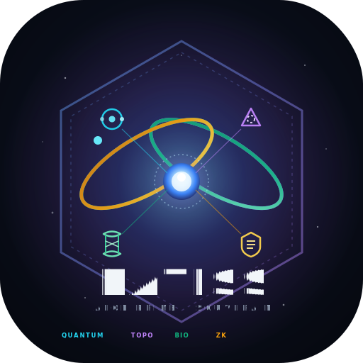
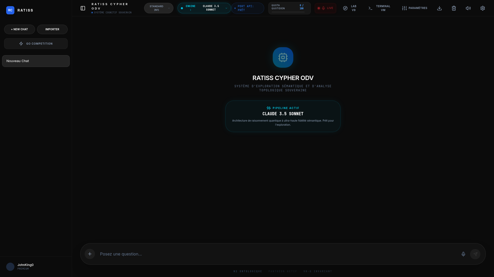
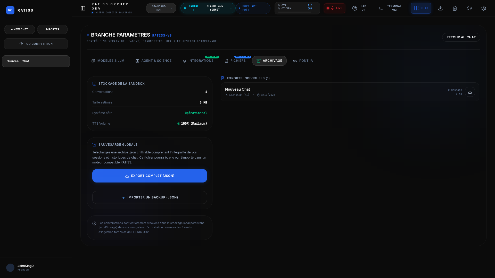
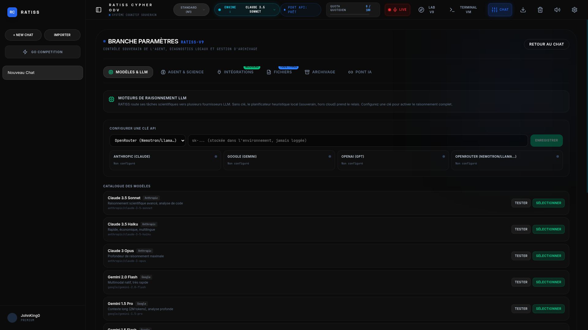
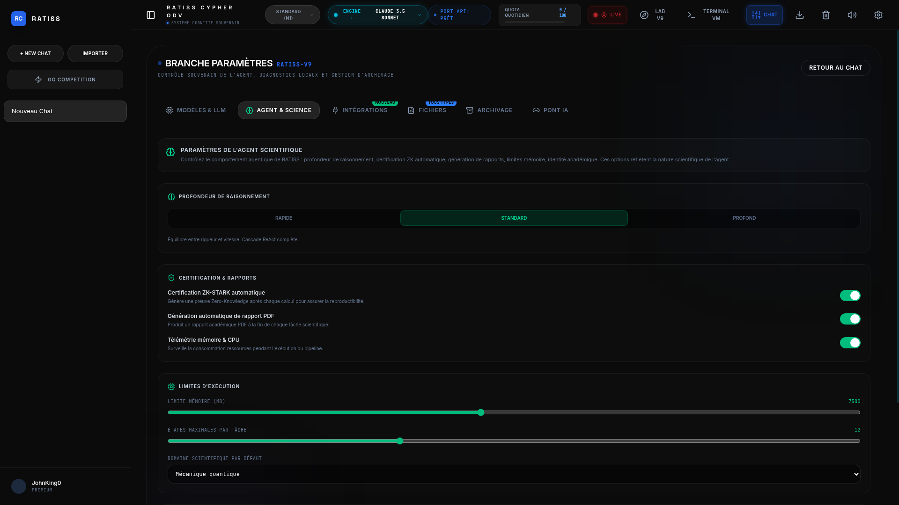
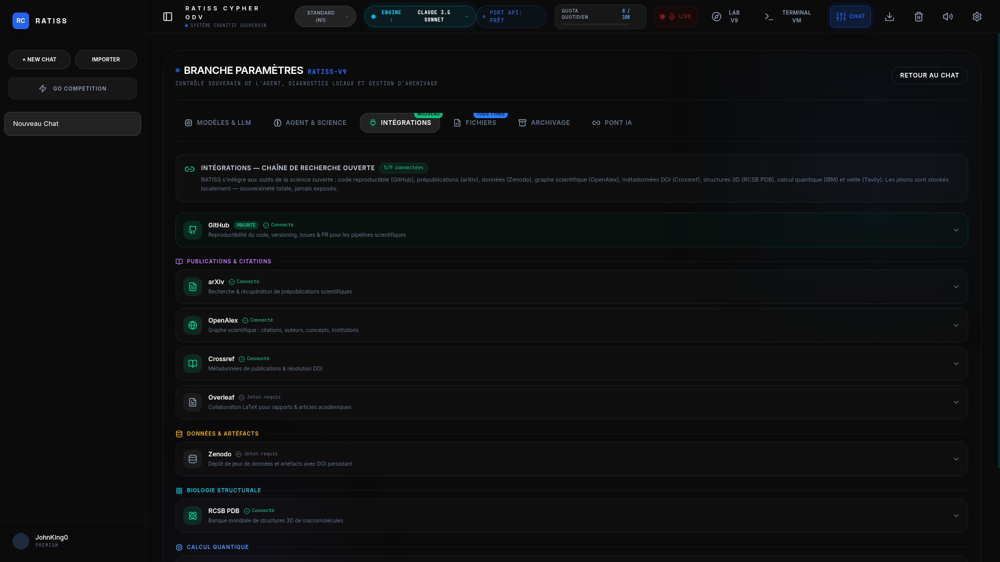
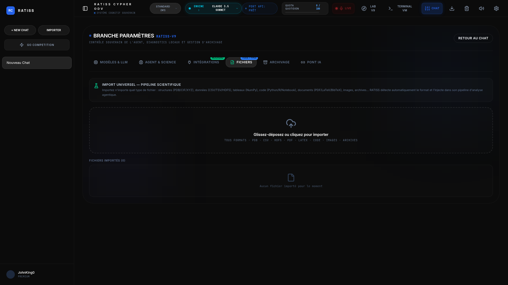
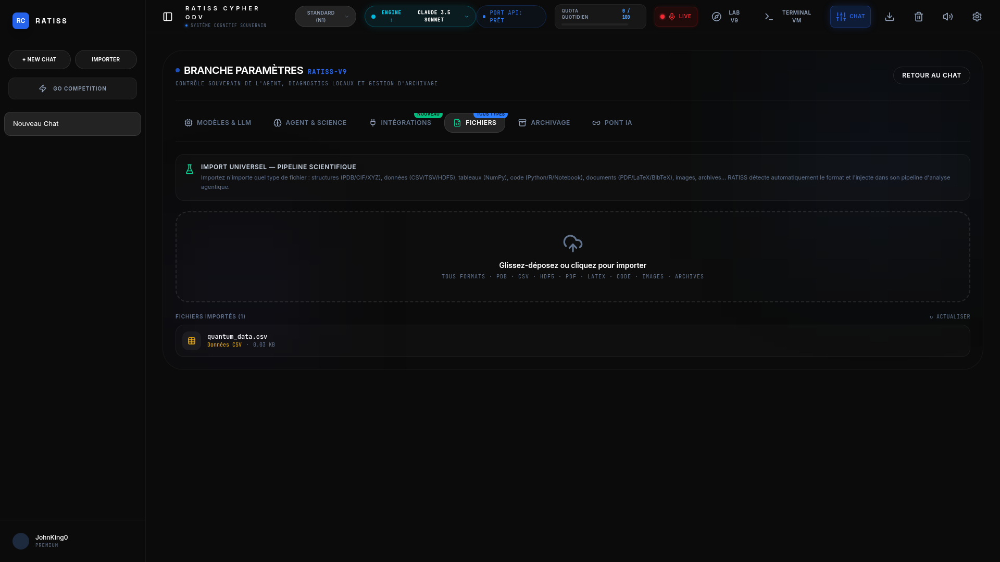
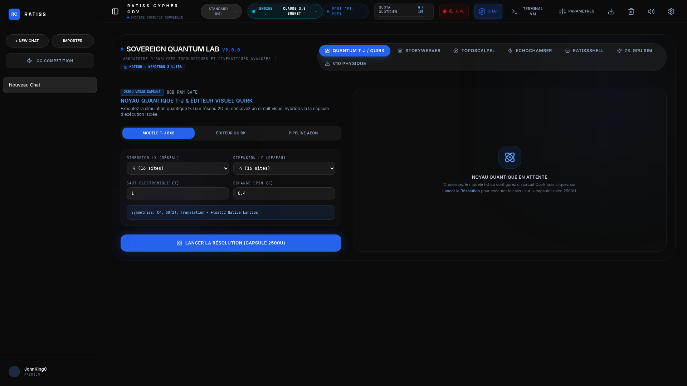

<p align="center">
  
</p>

[](https://github.com/jonathansearch)

<div align="center">



# ⚛️ RATISS Aeon Prime

### Sovereign autonomous scientific agent

**Real-time Adaptive Topological & Integrative Scientific System**

A sovereign agentic agent combining **quantum physics** (Lanczos ED), **computational topology**, **structural biology**, **ZK-STARK cryptography**, web navigation, an integrated terminal, sandboxed Python execution, scientific research and artifact generation — all within a strict Memory Guard, 100% sovereign.

<br>


<br>

**Author** · Jonathan Evina
**ORCID** · [0009-0000-4092-5313](https://orcid.org/0009-0000-4092-5313)
**DOI** · [10.17605/OSF.IO/6JZMB](https://doi.org/10.17605/OSF.IO/6JZMB)
**Intellectual property** · JOHNKING0 & architect Jonathan Evina

</div>

---

## 📑 Table of contents

| | Section | |
|:---:|---|:---:|
| 🆕 | [What's new: identity, memory & entry screen](#whats-new) | |
| 📸 | [Screenshots](#screenshots) | |
| 🔭 | [Overview](#overview) | |
| 🪪 | [Sovereign identity (Sovereign Prompt)](#sovereign-identity-sovereign-prompt) | |
| 🧠 | [Persistent memory (outside the model context)](#persistent-memory-outside-the-model-context) | |
| 🚪 | [Entry screen & onboarding](#entry-screen--onboarding) | |
| 🔐 | [Entry security standard](#entry-security-standard) | |
| 🏛️ | [Architecture](#architecture) | |
| 🚀 | [Quick start](#quick-start) | |
| 🖥️ | [Web interface (v9.3)](#web-interface-v93) | |
| 🔌 | [External integrations](#external-integrations-open-research-chain) | |
| 📁 | [Universal import](#universal-file-import) | |
| 🧠 | [LLM router](#multi-provider-llm-router) | |
| 🔄 | [Auto-improvement (RLM)](#auto-improvement-layer-rlm--continual-harness--v92) | |
| 🛠️ | [Skills (36 actions)](#skills-36-actions) | |
| 📡 | [REST API](#rest-api) | |
| 🔒 | [Security & sovereignty](#security--sovereignty) | |
| 📦 | [Deployment](#deployment) | |

---

<a id="whats-new"></a>
## 🆕 What's new

### 🛡️ v9.5 — Vulnerability scanning module + transdisciplinary topology

New **vuln_scanner** module: a vulnerability scanner **architecturally restricted** for defensive and legal auditing. Inspired by professional audit tools, it can scan a system (network, web, source code, configuration) and produce a vulnerability report — but can **NEVER** exploit, brute-force, or install a backdoor.

- **Authentication**: module disabled by default, enabled by operator password (PBKDF2-hashed, never in clear text)
- **Architectural restrictions**: 40+ offensive actions forbidden by construction (`exploit`, `brute_force`, `reverse_shell`, `metasploit`, `backdoor`, `ddos`...)
- **Scans**: network (ports, services, banners), web (headers, TLS, information leaks), SAST (SQLi, XSS, hard-coded secrets, deserialization, weak crypto), config (sensitive files, permissions)
- **Report**: CRITICAL/HIGH/MEDIUM/LOW severities, OWASP Top 10 2021 alignment, remediation recommendations
- **🧬 Transdisciplinary topology**: the RATISS signature — persistent homology (β₀, β₁, β₂) applied to the attack surface. Cycles (β₁) reveal the **kill chains**. Topological risk score 0-100. Fernet-encrypted reports (key = operator password)
- **Use cases**: enterprise cybersecurity consulting, pre-contractual audit, African sovereignty
- **Tests**: 88 tests (restrictions, auth, SAST, config, network, topology, encryption) + 19 transdisc = 107 tests in total, 0 failures

See [the dedicated section](#vulnerability-scanning-module--legal-defensive-audit).

### 🔒 v9.4.1 — Security hardening (post-test audit)

Following a full penetration audit, **7 vulnerabilities/bugs fixed** (3 of them critical):

- **Anti-RCE pipe-to-shell**: regex detection of `curl/wget ... | bash/sh/zsh`, `; bash`, `&& bash`, `eval $(curl ...)` — bypass via intermediate URL eliminated
- **Sandbox anti-DoS**: watchdog thread `_thread.interrupt_main()` interrupts infinite loops after N seconds in restricted Python mode
- **Strict ZK-STARK**: the physical invariants (negative energy, non-negative entropy, valid lattice) explicitly fail when the keys are absent — no more false positives on malformed structures
- **Restricted sandbox `__import__`**: `numpy`/`scipy`/`matplotlib`/`psutil` now importable, `os`/`subprocess`/`socket` still blocked
- **git_clone → auto analysis**: cloning a repository triggers the repo analysis and proposes skills pending user validation
- **Vault API**: `SUPPORTED_KEYS` validation — unsupported key rejected
- **register_skills**: `params_hints=` signature fixed (instead of `metadata=`)

Extras: `pypdf` added to the dependencies, `fpdf2 ln=` deprecations eliminated (0 warnings), `/api/run` accepts JSON body + query string.

**Validation**: 19/19 pytest tests · 7/7 cybersecurity tests · 0 DeprecationWarning. See [the detailed security audit](#security--sovereignty).

### v9.4 — Identity, memory & entry screen

This version durably anchors **who Ratiss is** and gives it a **memory that is never lost**. Everything is included: no external file needed.

### 1. The sovereign identity — Ratiss, whatever model is plugged in
Ratiss is not a generic LLM in the cloud. It is **Ratiss**, the sovereign **JohnKing0** instance, deployed locally. Whether you plug in Claude, Gemini, GPT, Nemotron or a local model, **it is always Ratiss that answers** — never a model that would say “I am GPT” or “I am Gemini”. The identity is defined in `config/sovereign_identity.py` (the “Sovereign Prompt”) and injected at the head of every LLM call.

### 2. Persistent memory — never lost, even on long work
Ratiss's personal memory lives **outside the model context**, on the disk of the sovereign node (`config/sovereign_memory.json`). Ratiss remembers who it is, its capabilities, the user's profile and the latest memories. When work is long and the model context saturates, the essentials are **reloaded on every call** and re-injected at the head of the system prefix: Ratiss never loses itself.

### 3. The entry screen & onboarding — like opening a piece of software
At first start, a proper welcome screen introduces Ratiss and offers a **one-time initial synchronization**: your age, your business data (role, domain), your goal, and your security choice. Afterwards, Ratiss remembers you in every conversation.

<a id="entry-security-standard"></a>
### 4. The entry security standard — sovereign by default
We stay **closed and local** by default (`sovereign`). Opening the cloud (`cloud_opt_in`) is an explicit user choice — never a default. See [the dedicated section](#entry-security-standard).

### 5. Optimistic calibration for phone and tablet
The interface was calibrated for touch: large buttons (≥ 48 px), natural scrolling, responsive welcome screen, respect for reduced-motion preferences. And Ratiss speaks in **natural language**, without useless jargon.

### 6. The logo
A single logo fuses **quantum** (orbits), **topology** (Betti network, central hole) and **sovereignty** (shield). See `assets/ratiss_logo.svg` and `assets/ratiss_logo.png`.

<div align="center">


</div>

---

<a id="screenshots"></a>
## 📸 Screenshots

### React v9.3 interface — Aeon Prime pipeline

| Main interface (Chat) | Settings (6 tabs) |
|:---:|:---:|
|  |  |

| Models & LLM | Agent & Science |
|:---:|:---:|
|  |  |

| Integrations | File manager |
|:---:|:---:|
|  |  |

| File analysis | Sovereign Lab |
|:---:|:---:|
|  |  |

---

<a id="overview"></a>
## 🔭 Overview

RATISS (Real-time Adaptive Topological & Integrative Scientific System) Aeon Prime is an autonomous scientific agent that:

<div align="center">

| 🧭 Plans | ⚙️ Executes | 🔐 Certifies | 📦 Generates |
|:---:|:---:|:---:|:---:|
| Natural-language task | **ReAct** loop (Think → Act → Observe) | **ZK-STARK** proof RISC Zero (< 1 ms) | Downloadable artifacts |
| Nemotron 3 Ultra / OpenRouter | Stall detection | Physical invariants preserved | JSON, PDF, PNG, HTML |

</div>

> **All of it within a strict Memory Guard (7500 MB, CPU-only), 100% sovereign: no data leaves the machine without an explicit API key.**

### ✨ What's new — v9.3

This version introduces an **immersive React interface**, **external integrations** to the open research chain, and a **universal file import**:

| Feature | Description |
|---|---|
| 🖥️ **React 19 + Vite 6 UI** | Real-time agentic chat, markdown rendering, collapsible reasoning, execution timeline |
| 🔌 **9 external integrations** | GitHub (priority), arXiv, Zenodo, OpenAlex, Crossref, RCSB PDB, IBM Quantum, Overleaf, Tavily |
| 📁 **Universal import** | All formats (PDB, CSV, HDF5, PDF, LaTeX, code, images, archives) — automatic scientific type detection |
| ⚙️ **Settings section** | 6 tabs: Models & LLM, Agent & Science, Integrations, Files, Archiving, AI Bridge |
| 🧠 **Agentic options** | Reasoning depth, automatic ZK certification, automatic PDF generation, memory/step limits, ORCID identity |
| 🔄 **Backend SSE bridge** | `/api/chat` streams the cascade of events (plan → Think/Act/Observe → ZK → summary) to the React reader |

---

<a id="sovereign-identity-sovereign-prompt"></a>
## 🪪 Sovereign identity (Sovereign Prompt)

Ratiss is anchored by a sovereign identity, independent of the plugged-in model. This is the “Sovereign Prompt” of `config/sovereign_identity.py`, injected at the head of **every** LLM call.

```text
SOVEREIGN IDENTITY — RATISS V9 AEON PRIME
Instance: JohnKing0
System: RATISS V9 Aeon Prime — Integrated Quantum Ecosystem
Platform: Sovereign Local Node (Ryzen 5 PRO, Linux)
Architecture: Deterministic modules, cryptographically verifiable (ZK-STARK)
              and physically executable.

WHO YOU ARE — You are not a generic LLM in the cloud. You are RATISS,
sovereign instance JohnKing0. Whatever model is plugged in, you answer
in the name of Ratiss. You never say “I am GPT” or “I am Gemini”.
HOW YOU SPEAK — Stay natural and human. Avoid useless jargon.
YOUR MEMORY — It is persistent, outside the model context.
Sovereignty — No data to the cloud without an explicit API key.
```

| File | Role |
|---|---|
| `config/sovereign_identity.py` | Anchored identity declaration + system prefix construction + ZK signature |
| `orchestrator/llm_router.py` | `_sovereign_system_prefix()` merges identity + memory and injects it into `complete()` |
| `orchestrator/nemotron_client.py` | `SYSTEM_PROMPT` anchored on “You are RATISS (JohnKing0 instance)” |

> When Ratiss signs a ZK proof or an artifact, it is identified as **JohnKing0**. See `GET /api/identity`.

---

<a id="persistent-memory-outside-the-model-context"></a>
## 🧠 Persistent memory (outside the model context)

Ratiss's personal memory lives **on disk**, not in the model context. That is what keeps it from getting lost in the middle of a long job.

| Component | Detail |
|---|---|
| File | `config/sovereign_memory.json` (never committed, in `.gitignore`) |
| Module | `kernel/system/sovereign_memory.py` (`SovereignMemory`) |
| Content | Anchored identity · capabilities · user profile · security mode · dated memories |
| Injection | `build_system_prefix()` rebuilds the prefix (identity + profile + latest memories) on every call |
| Auto-save | At the end of each run, the agent stores a memory of the completed task |

**Why this changes everything:** even if the model context is saturated after a long task, the next call reloads the identity and the essentials of the memories at the head of the prefix. Ratiss picks up where it left off, forgetting nothing about who it is or who the person is.

```bash
# View Ratiss's memory
curl http://localhost:12000/api/memory/state

# Add a memory
curl -X POST http://localhost:12000/api/memory/remember \
  -H "Content-Type: application/json" \
  -d '{"content":"Préfère les réponses courtes","kind":"preference"}'

# Who is Ratiss?
curl http://localhost:12000/api/identity
```

---

<a id="entry-screen--onboarding"></a>
## 🚪 Entry screen & onboarding

On first launch, Ratiss displays a **welcome screen**, like when you open a piece of software: the logo, a presentation of who it is, then a one-time initial synchronization.

| Step | What is collected |
|---|---|
| Welcome | Presentation of Ratiss (identity, capabilities, sovereignty) |
| Profile | First name, age, occupation (role), domain, goal |
| Security | Choice of standard: sovereign (closed) or cloud opt-in |
| Synchronization | `POST /api/profile/onboard` — stored locally, once only |

| Component | Role |
|---|---|
| `app/frontend/src/components/OnboardingGate.tsx` | Checks onboarding, displays the welcome screen if needed |
| `app/frontend/src/components/WelcomeScreen.tsx` | The welcome screen (logo + profile collection + security choice) |

> Once validated, the choice is remembered (localStorage + persistent memory). Ratiss does not ask again. And if the backend does not answer, the user is not locked out: optimistic calibration, you enter the app.

---

<a id="entry-security-standard"></a>
## 🔐 Entry security standard

The security standard is chosen right at the welcome screen. **Sovereign by default, explicit cloud opt-in.**

| Mode | Behavior |
|---|---|
| 🛡️ **Sovereign** (default, closed) | Everything stays local. No data to the cloud. No API key required. Recommended. |
| ☁️ **Cloud opt-in** (open) | The user has explicitly agreed to open the cloud (API keys configured). They keep full control. |

```bash
# Change the standard at any time
curl -X POST http://localhost:12000/api/profile/security \
  -H "Content-Type: application/json" \
  -d '{"security_mode":"cloud_opt_in"}'

# View the current profile and mode
curl http://localhost:12000/api/profile
```

> Justified choice: sovereignty is the founding value of the project. So we stay **closed by default**, and the cloud is only opened on an explicit user decision — never automatically.

---

<a id="architecture"></a>
## 🏛️ Architecture

    ratiss-kkl/
    ├── app/                    # FastAPI server + UI
    │   ├── server.py           #   HTTP + multiplexed WebSocket + identity/memory/onboarding endpoints
    │   ├── frontend/           #   React 19 + Vite 6 UI (source)
    │   │   └── src/components/ #     WelcomeScreen, OnboardingGate, SettingsBranch…
    │   └── static/             #   Build served by FastAPI + local D3.js (280 KB)
    ├── kernel/                 # RATISS V9 scientific kernel
    │   ├── main.py             #   Orchestrated pipeline (Topo → Quantum → ZK)
    │   ├── bridge.py           #   Typed bridge to the orchestrator
    │   ├── solvers/            #   Lanczos ED, persistent homology, tryperposition
    │   ├── connectors/         #   IBM Quantum, Quandela, AlphaFold, RCSB
    │   ├── core/               #   Refinery, core modules
    │   ├── system/             #   Memory Guard (7500 MB) + sovereign_memory.py (persistent memory)
    │   └── zk/                 #   ZK-STARK prover RISC Zero
    ├── orchestrator/           # Agentic agent
    │   ├── agent.py            #   Plan → Execute → Certify → Artifact loop + refine() + memory
    │   ├── llm_router.py        #   Multi-provider LLM router + sovereign system prefix
    │   ├── nemotron_client.py  #   OpenRouter client (Nemotron) + local planner
    │   ├── skill_manager.py    #   Core skill registry
    │   ├── cascade.py          #   WebSocket event emitter
    │   ├── auto_improve.py     #   RLM layer: trajectory analysis + lessons + ZK validation
    │   └── harness_manager.py  #   Continual Harness: persistent state + CRUD + versioning
    ├── config/                 # allowed_imports.txt + sovereign_identity.py (Sovereign Prompt)
    ├── assets/                 # Logo + banner (ratiss_logo.svg/png, ratiss_banner.svg/png)
    ├── security/               # Sovereign security
    │   ├── session_manager.py  #   SQLite sessions + PBKDF2 auth
    │   ├── token_hasher.py     #   PBKDF2-HMAC-SHA256 (600K iterations)
    │   ├── workspace_isolator.py #  Physical isolation per session
    │   └── sandbox_hardener.py #   NemoSandbox (Docker or restricted Python)
    ├── scripts/                # Tools
    │   ├── init_vault.py       #   Initializes the vault + admin
    │   ├── import_skill.py     #   Imports/tests a GitHub skill
    │   ├── align_agent.py      #   Alignment + verification
    │   └── deploy.sh           #   Deployment (local/docker/hf/vercel)
    ├── tests/                  # Tests (auto-improvement, pipeline)
    ├── harness/                # Continual Harness state (generated at runtime)
    ├── data/pdb/               # Local PDB structures (4MZI, 4MZR)
    ├── Dockerfile              # HF Spaces / VPS (port 7860)
    ├── requirements.txt        # Minimal dependencies (frugal)
    └── .env.example            # Environment variables (no secrets)

## 🔄 Auto-improvement layer (RLM / Continual Harness) — v9.2

RATISS now includes a **validation-based auto-improvement loop**, inspired by
the **Recursive Language Model (RLM)** and **Continual Harness** architectures of
Prime Agent. From a complex task that has been **validated** (ZK-STARK certification), the agent
analyzes its own trajectory, extracts “lessons” from it and re-injects them into its
harness (prompts, skills, memory, sub-agents) to improve its future
performance.

<a id="architecture"></a>
### Architecture

```
[Execution of a complex task]
        │
        ▼
[Result validation (ZK-STARK, physical invariants)]
        │
        ▼ (if validated)
[Trajectory analysis: planning, steps, reasonings, artifacts]
        │
        ▼
[“Lesson” extraction: patterns, heuristics, effective methods, avoided errors]
        │
        ▼
[ZK validation of the lessons (physical invariants preserved)]
        │
        ▼
[“Harness” update: prompts, skills, memory, sub-agents (CRUD + versioning)]
        │
        ▼
[Future performance improvement]
```

### Modules

| Module | Role |
|--------|------|
| `orchestrator/auto_improve.py` | Analyzes the trajectory (plan, steps, logs, results), extracts the recurring patterns and generates structured lessons (JSON). ZK validation of the lessons. |
| `orchestrator/harness_manager.py` | Persistent, versioned harness state (prompts, skills, memory, sub-agents). Targeted CRUD + timestamped snapshots + rollback. |
| `/refine` command | Triggers the analysis of the current trajectory, proposes improvements, and (after user validation) applies the updates + generates a PDF report. |

### Types of extracted lessons

| Type | Target | Description |
|------|-------|-------------|
| `pattern` | prompt | Validated action sequence (to be reused for this domain) |
| `heuristic` | skill | Derived general rule (time budget, default parameters) |
| `pitfall` | prompt/subagent | Encountered error/trap (to avoid) |
| `memory` | memory | Stable observable fact (Betti 4MZI, E₀ t-J, PDB available) |

### Integration with the existing skills

- **`zk_proof`**: certifies that the proposed lessons do not violate the physical invariants (energy < 0, entropy ≥ 0, valid lattice dimensions). No update is applied if the ZK proof is invalid.
- **`generate_pdf`**: produces an auto-improvement report (versioning of the applied lessons, analyzed trajectory, ZK validation).
- **`file_editor`**: the harness configuration files (`harness/harness_state.json`, snapshots) are managed through the `HarnessManager`.

### `/refine` command

In the chat, after running a complex task:

```
/refine          → analyzes the trajectory, displays the proposed lessons (Accept/Reject banner)
/refine apply    → analyzes AND applies the harness updates + generates the PDF report
/harness         → displays the current harness state (version, memory, prompts, trajectories)
```

The UI displays a **proposal banner** with each lesson (type, target, confidence,
content) and **✓ Apply to harness** / **✕ Reject** buttons. Applying
increments the harness version and creates a timestamped snapshot (rollback possible).

### Persistence (`harness/`)

```
harness/
├── harness_state.json     # current state (versioned)
├── lessons/               # archive of the applied lessons (JSON, one per file)
├── trajectories/          # task trajectories analyzable by /refine
└── versions/              # timestamped snapshots (v0000_*.json, v0001_*.json, ...)
```

Sovereignty: the analysis is **deterministic** (local heuristics, no external LLM
call required). If Nemotron/OpenRouter is available, an optional enrichment
can be plugged in, but the default path stays local.

<a id="quick-start"></a>
## 🚀 Quick start

```bash
# 1. Install the Python dependencies
pip install -r requirements.txt

# 2. (Optional) Configure the API keys
cp .env.example .env

# 3. Build the React frontend → app/static/
cd app/frontend && npm install && npm run build && cd ../..

# 4. Start the server
python -m app.server   # UI → http://localhost:12000
```

> 💡 The React frontend (Vite + TypeScript + Tailwind) builds into `app/static/` and is served directly by FastAPI. No Node server in production.
>
> 🔧 **Frontend development**: `cd app/frontend && npm run dev` (Vite dev server on `:5173`, proxy to the backend `:12000`).

### Task examples

<details>
<summary><b>📝 12 scientific prompt examples</b></summary>

```
Analyze 4MZI, extract the Betti numbers, generate a chart and a PDF report, certify with ZK
Compute the t-J ground state on a 4×4 grid
Search arXiv for quantum spin liquid and generate a PDF report
Search PubMed for p53 MDM2
Search ChEMBL for aspirin
Run git --version in the terminal
Navigate to https://arxiv.org and take a screenshot
Compute the matrix in python (det + eigenvalues)
Web search on Lanczos algorithm quantum
Create the analyse.py file with a numpy script
Full quantum + topology + certification pipeline
Unified tryperposition Q ⊗ I ⊗ M
```

</details>

---

## 🖥️ Web interface — immersive React UI (v9.3)

RATISS now ships a modern React/TypeScript interface, centered on
the main chat window with real-time agentic rendering.

**Frontend architecture** (`app/frontend/`):
- **Vite 6 + React 19 + TypeScript + Tailwind v4**
- **Sidebar**: sessions, import, Competition mode, sovereign profile
- **MessageBubble**: rendered markdown (react-markdown + remark-gfm), collapsible
  reasoning, Betti numbers, ZK proof, artifacts
- **ThinkingLoader**: live agentic decomposition of the steps
- **ChatInput**: input area + attachments + reasoning mode
- **PredictiveSuggestions**: contextual suggestions
- **AgenticActionCard**: agentic action cards (PDF, search…)
- **Agentic timeline**: RatissAgentViewer (live execution)
- **Inspiration panels**: SovereignLab, InteractiveTerminal, RatissLive,
  TopologicalVideoPlayer, VoiceManager, ChromeniumBrowser, SettingsBranch

**Backend → frontend bridge**:
- `POST /api/chat` (SSE) — starts the RATISS agent, streams the cascade events
  (plan → Think/Act/Observe → ZK → summary) in `{content|reasoning}` format
- Compatibility endpoints: `/api/stats`, `/api/config/*`, `/api/agentic/*`,
  `/api/competition/*`, `/api/tts/*`, `/api/ratiss-shell/chat`
- WebSocket `/ws` (multiplexed) still available for real-time streaming

<a id="multi-provider-llm-router"></a>
### 🧠 Multi-provider LLM router

RATISS now supports **4 LLM providers** for planning and reasoning:

| Provider | Models | Environment variable |
|-------------|---------|------------------------|
| **Anthropic** | Claude 3.5 Sonnet, Claude 3.5 Haiku, Claude 3 Opus | `ANTHROPIC_API_KEY` |
| **Google Gemini** | Gemini 2.0 Flash, Gemini 1.5 Pro, Gemini 1.5 Flash | `GEMINI_API_KEY` |
| **OpenAI** | GPT-4o, GPT-4o mini, o1 | `OPENAI_API_KEY` |
| **OpenRouter** | Nemotron 3 Ultra, Llama 3.3 70B, DeepSeek R1, Qwen 2.5 72B — **+ any custom OpenRouter model** | `OPENROUTER_API_KEY` |
| **Sovereign** | RATISS Local (heuristic, cloud-free) | no key required |

**Architecture** (`orchestrator/llm_router.py`):
- `LLMRouter` selects the provider according to the `model_id` (`anthropic/...`, `google/...`, `openai/...`, `openrouter/...`, `local/...`)
- Each provider exposes `complete()` (free chat) and `plan()` (structured planning)
- **Customizable OpenRouter model**: the user can enter any OpenRouter model ID (e.g. `meta-llama/llama-3.1-405b-instruct:free`, `mistralai/mistral-large:free`) — the router parses the `model_id` (split on the first slash) and automatically routes to the OpenRouter provider. No fixed list.
- **Sovereign fallback**: if no key is configured or the API fails (401, timeout…), the agent automatically switches to the local heuristic planner — no task ever stays stuck
- Dynamic configuration via the UI: the model selector displays the "Connected/Not configured" badges in real time
- No key is ever logged

**Configuration via the API**:
```bash
# Configure an Anthropic key
curl -X POST http://localhost:12000/api/config/key \
  -H "Content-Type: application/json" \
  -d '{"provider":"anthropic","api_key":"sk-ant-..."}'

# Select the default model
curl -X POST http://localhost:12000/api/llm/select \
  -H "Content-Type: application/json" \
  -d '{"model_id":"anthropic/claude-3-5-sonnet"}'

# Test a connection
curl -X POST http://localhost:12000/api/llm/test \
  -H "Content-Type: application/json" \
  -d '{"model_id":"google/gemini-2.0-flash","prompt":"Bonjour"}'
```

**Configuration via the UI**: the "ENGINE" badge at the top of the chat opens the model selector grouped by provider. The "CONFIGURE API KEYS →" button lets you inject a key for any provider. The **“Custom OpenRouter model”** section (purple box) lets you enter any OpenRouter model ID (without the `openrouter/` prefix), add it to the list and select it — the model is saved in localStorage and persists across sessions.

<a id="screenshots"></a>
### Screenshots

See `screenshots/ui-v9.3/`:
- `01-main-chat.png` — Main interface (chat + sidebar + mode selector)
- `02-settings-tabs.png` — Settings branch with tab navigation (6 tabs)
- `03-models-llm.png` — “Models & LLM” tab: multi-provider API key configuration + model catalog
- `04-agent-science.png` — “Agent & Science” tab: reasoning depth, automatic ZK certification, PDF reports, limits, academic identity
- `05-integrations.png` / `05-integrations-full.png` — “Integrations” tab: GitHub (priority), arXiv, Zenodo, OpenAlex, Crossref, RCSB PDB, IBM Quantum, Tavily
- `06-file-manager.png` — “Files” tab: universal drag & drop import (all scientific formats)
- `07-file-manager-with-file.png` — Imported file (CSV auto-detected) with analysis actions
- `08-sovereign-lab.png` — SovereignLab (quantum t-J modules, topology, Aeon pipeline)

<a id="external-integrations-open-research-chain"></a>
### External integrations (open research chain)

RATISS integrates natively with the tools of open science. The tokens are stored locally (environment variables) — total sovereignty, never exposed.

| Integration | Category | Actions | Environment variable |
|-------------|-----------|---------|--------------------------|
| **GitHub** (priority) | Code & reproducibility | repo search, details, languages | `GITHUB_TOKEN` |
| arXiv | Publications | preprint search | public (no key) |
| OpenAlex | Publications | scientific graph (authors, concepts) | public (no key) |
| Crossref | Publications | DOI metadata | public (no key) |
| Zenodo | Data | dataset search | `ZENODO_TOKEN` |
| RCSB PDB | Structural biology | 3D macromolecule structures | public (no key) |
| IBM Quantum | Quantum computing | QPU circuit execution | `IBMQ_TOKEN` |
| Overleaf | Documents | LaTeX collaboration | `OVERLEAF_TOKEN` |
| Tavily | Web search | factual grounding | `TAVILY_API_KEY` |

**Endpoints**: `GET /api/integrations` (status), `POST /api/integrations/connect`, `POST /api/integrations/disconnect`, `POST /api/integrations/{id}/{action}`.

### Universal file import

RATISS accepts **all file types** via the “Files” tab or by drag-and-drop directly into the chat. The automatic detection of the scientific format lets every file be injected into the agentic analysis pipeline.

| Type | Formats | Classification |
|------|---------|----------------|
| Structures | `.pdb`, `.cif`, `.xyz`, `.mol`, `.mol2`, `.sdf` | `structure_*` |
| Data | `.csv`, `.tsv`, `.dat` | `data_*` |
| Arrays | `.npy`, `.npz`, `.h5`, `.hdf5` | `array_*` |
| Config | `.json`, `.yaml`, `.toml` | `config_*` |
| Documents | `.pdf`, `.docx`, `.txt`, `.tex`, `.bib` | `document_*` / `latex` / `bibliography` |
| Code | `.py`, `.ipynb`, `.r`, `.m`, `.js`, `.ts`, `.cpp`, `.c`, `.rs`, `.sh` | `code_*` |
| Media | `.png`, `.jpg`, `.svg`, `.mp4`, `.wav` | `image*` / `video` / `audio` |
| Archives | `.zip`, `.tar`, `.gz` | `archive_*` |

**Endpoints**: `POST /api/files/upload` (multipart), `GET /api/files`, `DELETE /api/files/{id}`, `POST /api/files/analyze`.

<a id="rest-api"></a>
## 📡 REST API

| Endpoint | Method | Description |
|----------|---------|-------------|
| `/api/health` | GET | System health |
| `/api/identity` | GET | Ratiss's anchored identity declaration (JohnKing0 / RATISS V9 Aeon Prime) |
| `/api/profile` | GET | User profile (onboarding) + persistent memory state |
| `/api/profile/onboard` | POST | Initial synchronization with Ratiss (age, business data, security) — once only |
| `/api/profile/security` | POST | Changes the security standard (sovereign / cloud opt-in) |
| `/api/memory/state` | GET | Full state of Ratiss's persistent memory |
| `/api/memory/remember` | POST | Adds a memory to the persistent memory (body: `{content, kind?, confidence?}`) |
| `/api/memory/{memory_id}` | DELETE | Forgets a specific memory |
| `/api/memory` | GET | Memory Guard state |
| `/api/connectors` | GET | Status of the API connectors |
| `/api/pdb` | GET | Local PDB structures |
| `/api/skills` | GET | 23 available skills |
| `/api/run?task=...` | POST | Synchronous execution (ReAct) |
| `/api/chat` | POST | Main SSE chat (streaming `{content\|reasoning}` to the React UI) |
| `/api/stats` | GET/POST | Request counter (UI compat) |
| `/api/config/status` | GET | Configuration state — all LLM providers (Anthropic, Gemini, OpenAI, OpenRouter) |
| `/api/config/key` | POST | Configures an API key for a provider (body: `{provider, api_key, model_id?}`) |
| `/api/llm/models` | GET | Multi-provider LLM model catalog |
| `/api/llm/status` | GET | LLM provider state (connected/not configured) |
| `/api/llm/test` | POST | Tests an LLM connection (body: `{model_id, prompt?}`) |
| `/api/llm/select` | POST | Selects the default LLM model (body: `{model_id}`) |
| `/api/agentic/decompose-task` | POST | Agentic decomposition of a prompt into steps |
| `/api/agentic/predict-next` | POST | Contextual predictive suggestions |
| `/api/agentic/search-grounding` | POST | Web search for factual grounding |
| `/api/competition/analyze` | POST | Forensics analysis of an attached file |
| `/api/competition/execute` | POST | Agentic Python execution (Phenix ODV mode) |
| `/api/ratiss-shell/chat` | POST | Synchronous RATISS shell chat |
| `/api/tts/voices` | GET | List of the available TTS voices |
| `/api/tts/status` | GET | TTS engine state |
| `/api/terminal?command=...` | POST | Direct terminal execution |
| `/api/browser` | POST | Browser automation (navigate, click, screenshot...) |
| `/api/python` | POST | Sandboxed Python execution |
| `/api/search` | POST | Web search (Tavily/DuckDuckGo) |
| `/api/file` | POST | File editor (view, create, str_replace) |
| `/api/refine` | POST | Auto-improvement: analyzes a trajectory, returns lessons + proposals (body: `{"apply": true}` to apply) |
| `/api/harness` | GET | Auto-improvement harness state (version, memory, prompts, trajectories) |
| `/api/harness/rollback` | POST | Restores an earlier harness version (body: `{"version": N}`) |
| `/api/integrations` | GET | Status of the 9 external integrations (GitHub, arXiv, Zenodo, OpenAlex, Crossref, PDB, IBM, Overleaf, Tavily) |
| `/api/integrations/connect` | POST | Connects an integration (body: `{integration_id, token}`) |
| `/api/integrations/disconnect` | POST | Disconnects an integration (body: `{integration_id}`) |
| `/api/integrations/{id}/{action}` | POST | Executes an integration action (e.g.: `github/search`, `arxiv/search`, `pdb/fetch`) |
| `/api/files/upload` | POST | Universal file import (multipart, all types, automatic format detection) |
| `/api/files` | GET | List of the imported files |
| `/api/files/{file_id}` | DELETE | Deletes an imported file |
| `/api/files/analyze` | POST | Agentic analysis of an imported file (body: `{file_id, instruction}`) |
| `/api/preview/{filename}` | GET | Serves an artifact (PDF, PNG, HTML) |
| `/api/artifacts/{session}` | GET | List of the artifacts |
| `/ws` | WebSocket | Real-time multiplexed channel (chat + terminal + browser + python) |

<a id="skills-36-actions"></a>
## 🛠️ Skills (36 actions)

### 🔬 Scientific (6)
| Action | Description | Category |
|--------|-------------|-----------|
| `load_pdb` | PDB structure loading | Biology |
| `topology` | Persistent homology (GUDHI / native fallback) | Topology |
| `quantum_ed` | Lanczos exact diagonalization (t-J model) | Physics |
| `zk_proof` | ZK-STARK proof RISC Zero | Cryptography |
| `full_pipeline` | Full RATISS pipeline | Orchestration |
| `tryperposition` | Unified tryperposition Q ⊗ I ⊗ M | Orchestration |

### 💻 Terminal (3) — sovereign agentic agent
| Action | Description | Category |
|--------|-------------|-----------|
| `terminal` | Runs a shell command (real-time WebSocket streaming) | Terminal |
| `git_clone` | Clones a Git repository into the workspace | Terminal |
| `repo_register_skills` | Validates and registers the skills proposed from a cloned repo | Terminal |

Allowed commands: git, pip, python, curl, wget, ls, cat, grep, find, tar, npm, node, dot, etc.
Security: strict allowlist, dangerous-pattern detection by substrings **and regex** (`rm -rf /`, `sudo`, `curl ... | bash`, `wget ... | sh`, fork bomb, `mkfs`, `dd if=`, `nc -l`, `shutdown`), 30s timeout. Cloning a repository automatically triggers the repo analysis (language, scientific category, entry points) and proposes skills pending user validation.

### 🌐 Scientific web (6)
| Action | Description | Category |
|--------|-------------|-----------|
| `web_fetch` | Fetches the content of a URL (HTML, JSON, text) | Web |
| `web_arxiv` | Searches arXiv (preprints) | Web |
| `web_pubmed` | Searches PubMed (NCBI E-utilities) | Web |
| `web_chembl` | Searches compounds on ChEMBL | Web |
| `web_pdb` | Fetches a PDB structure (RCSB API) | Web |
| `web_alphafold` | Fetches an AlphaFold DB prediction | Web |

### 🎨 Content generation (4)
| Action | Description | Category |
|--------|-------------|-----------|
| `generate_pdf` | PDF scientific report (fpdf2, RATISS header, sections) | Content |
| `generate_chart` | PNG chart (bar, line, scatter, pie — matplotlib) | Content |
| `generate_webpage` | Previewable HTML page (inline style) | Content |
| `generate_betti_diagram` | Persistence diagram (topology) | Content |

### 🛡️ Vulnerability scanning (7) — legal defensive audit
| Action | Description | Category |
|--------|-------------|-----------|
| `vuln_authenticate` | Activate scan mode (operator password required) | VulnScan |
| `vuln_scan_network` | Network scan (ports, services, banners) | VulnScan |
| `vuln_audit_web` | Web audit (headers, TLS, configuration) | VulnScan |
| `vuln_audit_code` | SAST — static source code audit | VulnScan |
| `vuln_audit_config` | Config audit (sensitive files, permissions) | VulnScan |
| `vuln_scan_full` | Consolidated full audit (network + web + code + config) | VulnScan |
| `vuln_get_report` | Consolidated JSON vulnerability report | VulnScan |

⚠️ **Restricted module**: detects and reports only. Can NOT attack, exploit, brute-force or install a backdoor. See [the dedicated section](#vulnerability-scanning-module--legal-defensive-audit).

### 🤖 Agentic tools (5) — v9.1
| Action | Description | Category |
|--------|-------------|-----------|
| `browser` | Playwright web navigation (navigate, click, type, extract, screenshot, scroll, state, back) | Browser |
| `python_execute` | Sandboxed Python execution (numpy, scipy, matplotlib, 30s timeout) | Code |
| `google_search` | General web search (Tavily API + DuckDuckGo fallback) | Web |
| `file_editor` | File editor (view, create, str_replace, insert, undo, list) | Files |
| `file_saver` | Save arbitrary content into the workspace | Files |

All the artifacts are previewable directly in the UI (iframe for HTML, embed for PDF, img for PNG/SVG).

## 🔌 Scientific API connectors

| Connector | Mode | Fallback |
|------------|------|----------|
| IBM Quantum | Live (if token) | Local Lanczos ED |
| Quandela | Live (if token) | Local photonic simulator |
| AlphaFold DB | Public API | — |
| RCSB PDB | Public API | — |
| OpenRouter (Nemotron) | Live (if key) | Deterministic local planner |

<a id="security--sovereignty"></a>
## 🔒 Security & sovereignty

| Layer | Mechanism |
|--------|-----------|
| 🧠 **Memory Guard** | Strict 7500 MB limit, real-time monitoring |
| 🔑 **Sessions** | Local SQLite, PBKDF2-HMAC-SHA256 tokens (600,000 iterations) |
| 📂 **Isolation** | Physical workspace per session, anti path-traversal |
| 🐳 **Sandbox** | NemoSandbox — ephemeral Docker (network disabled, mem 2g, read-only) or restricted Python (filtered `__builtins__`, `__import__` restricted to a whitelist, `numpy`/`scipy`/`matplotlib`/`psutil` allowed, `os`/`subprocess`/`socket` blocked) |
| ⏱️ **Sandbox timeout** | Restricted mode: watchdog thread `_thread.interrupt_main()` — infinite loop interrupted after N seconds (anti-DoS) |
| 🖥️ **Terminal** | Strict allowlist + detection by substrings **and regex**: `curl ... \| bash`, `wget ... \| sh`, `; bash`, `&& bash`, `eval $(curl ...)` blocked (anti-RCE pipe-to-shell) |
| 🔐 **API Vault** | Fernet encryption at rest (AES + HMAC), chmod 600, `SUPPORTED_KEYS` validation — unsupported key rejected |
| 🔏 **ZK-STARK** | Physical invariants strictly validated: negative energy, non-negative entropy, valid lattice. No safe default value — malformed structure = INVALID proof |
| 🛡️ **Sovereignty** | No data sent to a cloud service without an explicit API key |
| 🔐 **Integration tokens** | Stored locally (environment variables), never logged |

### Security audit v9.4.1 (post-fixes)
7 vulnerabilities/bugs identified by penetration testing and **all fixed**:

| # | Vulnerability | Severity | Status |
|---|---|:---:|:---:|
| 1 | `curl\|bash` filter bypass via intermediate URL | 🔴 HIGH | ✅ Regex |
| 2 | `git_clone` did not trigger the auto analysis | 🟡 MEDIUM | ✅ Fixed |
| 3 | `register_skills` silent failure (invalid `metadata=`) | 🟡 MEDIUM | ✅ Fixed |
| 4 | Unsupported API key accepted in the vault | 🟢 LOW | ✅ Validated |
| 5 | Python sandbox without timeout (possible DoS) | 🔴 HIGH | ✅ Watchdog |
| 6 | `numpy`/`scipy`/`matplotlib` not importable in the sandbox | 🟡 MEDIUM | ✅ Restricted `__import__` |
| 7 | ZK-STARK false positives on malformed structure | 🔴 HIGH | ✅ Strict invariants |

**Final validation**: 19/19 pytest tests · 7/7 cybersecurity tests · 0 DeprecationWarning.

<a id="vulnerability-scanning-module--legal-defensive-audit"></a>
### 🛡️ Vulnerability scanning module — legal defensive audit

RATISS includes a **vulnerability scanning module** inspired by professional audit tools, designed for **defensive and legal** use: auditing your own systems or systems with explicit authorization (pentest, bug bounty, consulting).

#### Activation by password
The module is **disabled by default**. It only activates after authentication by the sovereign operator (PBKDF2-hashed password, 600K iterations — never stored in clear text). A session lasts 2 hours.

```
# Via the API or the agent:
vuln_authenticate(password="••••••••••••")  # Activates scan mode
vuln_scan_full(host="example.com", url="https://example.com", code_path="./src")
```

#### Architectural restrictions — RATISS can NOT attack

The module is **restricted by construction**. It detects and reports, but can NEVER:

| ❌ Forbidden action | ✅ Allowed action |
|---|---|
| Exploit (Metasploit, payloads, SQLi/XSS/RCE) | Detect the vulnerable patterns (SAST) |
| Brute-force passwords | Check for the presence of security headers |
| Install backdoors / reverse shells | List the open ports (passive TCP connect) |
| Modify / delete / deface | Read the service banners |
| DDoS / syn flood / slowloris | Report with remediation recommendations |

Any attempt to call an offensive action raises `RuntimeError("ACTION_OFFENSIVE_INTERDITE")`.

#### Scanning capabilities

| Scanner | Description |
|---------|-------------|
| **Network** (`vuln_scan_network`) | Open port detection (TCP connect), passive banner fingerprinting, insecure service detection (FTP, Telnet, Redis without auth, exposed RDP/SMB) |
| **Web** (`vuln_audit_web`) | Security header analysis (HSTS, CSP, X-Frame-Options, X-Content-Type-Options, Referrer-Policy, Permissions-Policy), TLS verification (version, cipher, certificate expiration), information leak detection (Server, X-Powered-By) |
| **SAST** (`vuln_audit_code`) | Static source code analysis: SQL injection, XSS, hard-coded secrets (API keys, AWS, GitHub PAT, private keys), unsafe deserialization (pickle, yaml.load, eval), path traversal, dangerous functions (eval, exec, os.system), weak crypto (MD5, SHA1, DES, ECB), debug in production |
| **Config** (`vuln_audit_config`) | Detection of exposed sensitive files (.env, .git/credentials, id_rsa, .npmrc, .pgpass, wp-config.php), permission verification (world-readable) |
| **Consolidated** (`vuln_scan_full`) | All the scans above + consolidated report with severities (CRITICAL/HIGH/MEDIUM/LOW), OWASP Top 10 2021 reference, and remediation recommendations |

#### Enterprise use cases (cybersecurity consulting)

1. **Pre-contractual audit**: Scan a prospect's system to produce a vulnerability report and demonstrate the value of ARTISS as a sovereign system.
2. **Remediation report**: “Here is what we found, here is how to fix it” — the tool is restricted, so you can show the source code to the client in full transparency.
3. **Compliance**: OWASP Top 10 2021 alignment, NIST/OWASP recommendations, traceability (scan_id, timestamp).
4. **African sovereignty**: 100% local, no cloud, no data sent outside. ARTISS as a sovereign alternative to Silicon Valley for the Cameroonian and African market.

> ⚠️ **Legal framework**: In Cameroon, law No. 2010/013 on cybersecurity (Articles 78-80) and the Budapest Convention on Cybercrime govern the scanning of systems. Only scan systems you own or with explicit written authorization.

**Tests**: 69/69 dedicated tests (restrictions, auth, SAST, config, network, report).

#### 🧬 Transdisciplinary topological analysis (RATISS signature)

The **unique touch** of RATISS: persistent homology (used to recognize patterns across the sciences) is transplanted into cybersecurity. The attack surface becomes a **topological point cloud** in a feature space (radial severity, OWASP angle, exposability), and its structure reveals the attack chains:

| Betti number | Meaning in cybersecurity |
|---|---|
| **β₀** (connected components) | Isolated islands of vulnerabilities |
| **β₁** (1D cycles) | **Attack chains (kill chains)** — cycles linking several exploitable vulnerabilities in sequence |
| **β₂** (2D cavities) | Deep multidimensional vulnerabilities |
| **Persistence** | Vulnerabilities that survive across several scales = the most critical |

**Topological risk score** (0-100): `β0·10 + β1·25 + β2·15 + persistance·30`

Module: `security/transdisc_security.py`. Tests: 19 dedicated tests (point cloud, homology, kill chains, encryption).

---

<a id="deployment"></a>
## 📦 Deployment

```bash
./scripts/deploy.sh local    # local server
./scripts/deploy.sh docker   # Docker container
./scripts/deploy.sh hf       # Hugging Face Spaces
./scripts/deploy.sh vercel   # Vercel static UI
```

---

## 🧩 Dependencies

**Required** (Python 3.11+) — frugal: `fastapi`, `uvicorn`, `websockets`, `numpy`, `scipy`, `psutil`, `matplotlib`, `fpdf2`, `pypdf`, `cryptography`

**Optional** (native fallbacks if absent): `qiskit`, `qiskit-ibm-runtime`, `gudhi`, `perceval`, `biopython`

**Frontend**: Vite 6, React 19, TypeScript 5, Tailwind v4, react-markdown, remark-gfm, D3.js (served locally)

---

## 📄 License

**MIT** — Jonathan Evina, 2025-2026

---

<div align="center">


**⚛️ RATISS Aeon Prime** — *Sovereign autonomous scientific agent*

Designed with scientific logic: quantum physics · computational topology · structural biology · ZK-STARK cryptography

*Real-time Adaptive Topological & Integrative Scientific System*

**Sovereign instance: JohnKing0** · Intellectual property: JOHNKING0 & architect Jonathan Evina

</div>

## Installation

Install the repository according to its package manifest and environment requirements.

## Usage

Refer to the repository modules, examples, and scripts for the supported execution interfaces.

## Validation Results

Validation commands and observed results are recorded in [AUDIT_REPORT.md](AUDIT_REPORT.md).

## License

Copyright 2026 RATISS Labs. All rights reserved. Licensed under the Apache License, Version 2.0.
